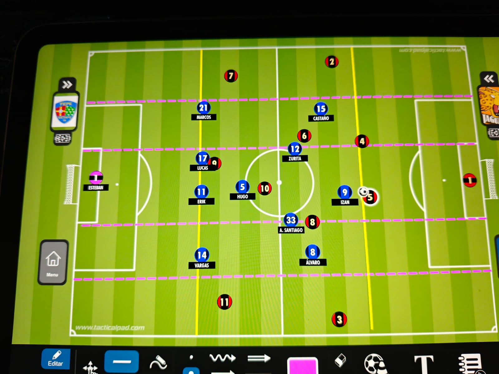
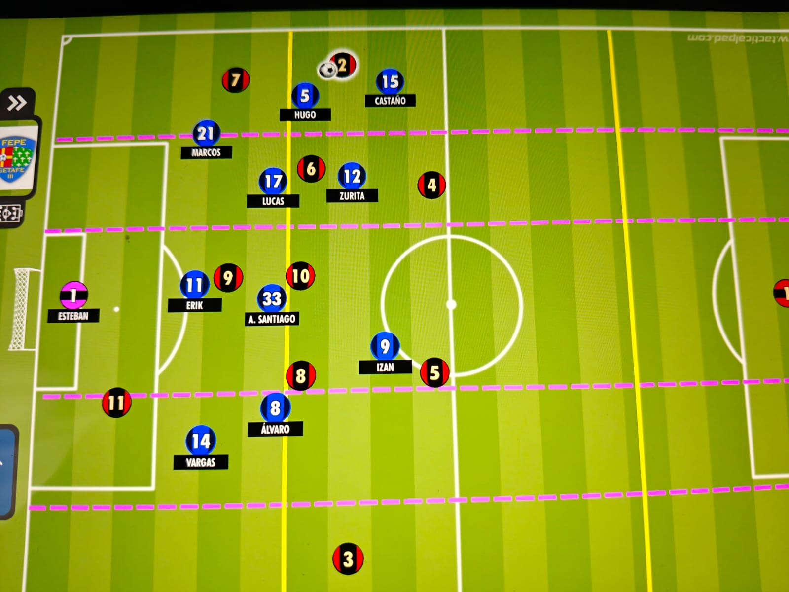
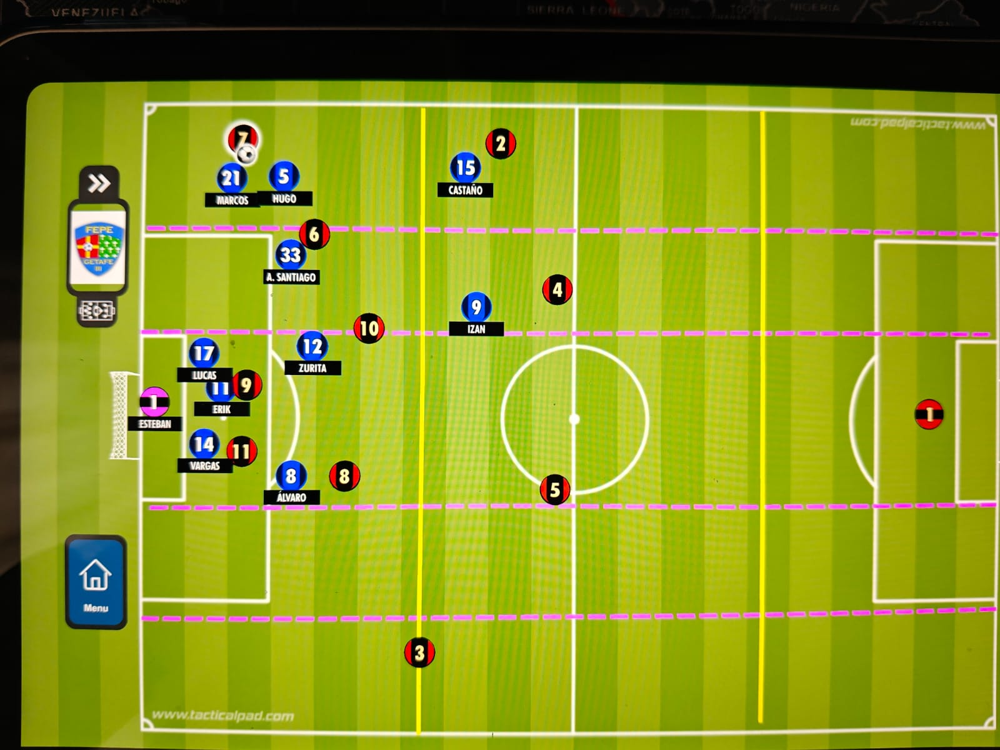

# ADN del Modelo de Juego — versión para entrenadores
### Cadete, Segundo Año, Segunda División

---

Este documento es la versión legible del ADN — el mismo contenido que `ADN-Modelo-de-Juego.md` (la versión pensada para que la app la importe), pero en prosa, sin nombres de campo ni bloques de datos, para leer, discutir y corregir con cualquier entrenador. Cuando se cierre un cambio aquí, hay que trasladarlo también a la versión técnica, y viceversa — las dos deben decir siempre lo mismo.

Está en construcción: de momento tiene desarrollado en detalle Defensa organizada (Principio 1 — No permitir progresar al rival — y Principio 2 — Recuperar el balón —), Transición defensa-ataque (Principio 1 — decidir velocidad vs. paciencia según zona de recuperación — y Principio 2 — ejecutar la verticalidad según el gatillo de robo —), Ataque organizado (Principio 1 — Progresar con balón — y Principio 2 — Generar y resolver la ocasión de gol —), Transición ataque-defensa (Principio 1 — reaccionar de inmediato a la pérdida según la zona —), y la sección de Balón parado. El ciclo completo de las cuatro fases más balón parado está desarrollado con la jerarquía Principio → Subprincipio → Sub-subprincipio → Habilidad; quedan matices y revisiones pendientes que se irán afinando en próximas sesiones.

---

## 1. Defensa organizada

1. **No permitir progresar al rival.** Objetivo transversal de toda la fase: impedir que el rival avance hacia nuestra portería, sin especificar todavía la vía concreta (puede ser por dentro, por fuera o en profundidad — eso lo definen los subprincipios).

   - **Subprincipio 1.1 — Evitar que el rival supere nuestra primera línea de presión.** Una de las formas de no dejar progresar al rival es no permitirle superar con comodidad la línea más adelantada de presión, obligándole a jugar hacia atrás, hacia los lados, o a perder el balón directamente ahí.

     - **Zona de Finalización.** La zona más cercana a la portería rival — aquí el equipo presiona altísimo, buscando robar lo más lejos posible de nuestra portería. Se aceptan riesgos calculados (como dejar libre al lateral opuesto rival) porque la recompensa de robar cerca de su área lo compensa. Sistema base asumido: 1-4-2-3-1.

       - **Sub-subprincipio 1.1.1 — Delantero:** arranca desde el carril central pegado al área, presiona al central con balón, corriendo en curva entre el central y el portero, para obligarle a centrar hacia la banda.
         - Habilidad imprescindible — **Activación**: arranca la presión en cuanto detecta el movimiento del balón hacia el central, no cuando ya lo ha recibido o controlado. (Entrenable: presión iniciada a la señal del pase hacia el central, penalizando la salida tardía tras la recepción.)
         - Habilidad imprescindible — **Perfilamiento**: orienta el cuerpo en la carrera describiendo una curva, para cerrar la vía de pase más segura (hacia atrás) y forzar el pase lateral. (Entrenable: ejercicios de presión al central con portero, evaluando si el ángulo de aproximación cierra la vía de vuelta.)
       - **Sub-subprincipio 1.1.2 — Extremo (lado del balón):** marca muy cerca al lateral rival de su lado.
         - Habilidad imprescindible — **Anticipación**: llega a distancia de intercepción antes de que el lateral rival reciba el balón, no después. (Entrenable: presión cronometrada midiendo si el extremo llega a distancia de robo antes del primer control del lateral.)
         - Habilidad imprescindible — **Perfilamiento**: se aproxima cortando el ángulo de pase hacia carriles centrales, no en línea recta hacia el hombre. (Entrenable: ejercicios de presión con distintos orígenes de pase, ajustando el ángulo de llegada en cada repetición.)
       - **Sub-subprincipio 1.1.3 — Media punta:** marca a un pivote rival.
         - Habilidad imprescindible — **Carga**: se coloca detrás del pivote, entre él y nuestra portería, y usa el cuerpo pegado para impedir que se gire con el balón controlado. (Entrenable: ejercicios de marcaje de espaldas con presión inmediata, puntuando si el pivote logra girarse o no.)
       - **Sub-subprincipio 1.1.4 — Mediocentro A:** marca al otro pivote rival.
         - Habilidad imprescindible — **Carga**: misma exigencia que la mediapunta en 1.1.3, aplicada a su propio pivote. (Entrenable: mismo ejercicio, con el mediocentro defendiendo su marca asignada.)
       - **Sub-subprincipio 1.1.5 — Mediocentro B:** marca a la media punta/enganche rival (si el rival juega con esa posición).
         - Habilidad imprescindible — **Anticipación**: reconoce y fija la marca sobre el enganche rival en el instante en que el equipo inicia la presión alta, sin dudar. (Entrenable: ejercicios de presión coordinada con un enganche rival fijo, midiendo el tiempo de reacción hasta fijar la marca.)
         - Habilidad imprescindible — **Comunicación**: avisa en voz alta a quién marca antes de que arranque la presión, para no dejar al enganche sin marca por duda entre compañeros. (Entrenable: ejercicios de presión coordinada exigiendo verbalizar la asignación antes de arrancar la jugada.)
       - **Sub-subprincipio 1.1.6 — Central A (el que marca):** marca de cerca al delantero rival.
         - Habilidad imprescindible — **Anticipación**: mantiene distancia corta constante para llegar antes que el delantero a cualquier balón dirigido hacia él. (Entrenable: marcaje 1vs1 con balones dirigidos al delantero desde distintos orígenes, exigiendo que el central llegue primero.)
       - **Sub-subprincipio 1.1.7 — Central B (el que vigila):** cobertura/vigilancia sobre el delantero rival y el espacio, sin comprometerse en marcaje estricto.
         - Habilidad imprescindible — **Temporización**: se mantiene en posición goal-side, listo para intervenir solo si el central A es superado o aparece un segundo atacante, sin lanzarse a perseguir al delantero. (Entrenable: 2vs1 defensivo penalizando al central de cobertura si se lanza a por el balón en vez de mantener la posición de ayuda.)
       - **Sub-subprincipio 1.1.8 — Lateral (lado del balón):** marca al extremo rival de su lado.
         - Habilidad imprescindible — **Activación**: inicia la subida a marcar al extremo rival en el mismo instante en que arranca la presión colectiva, no antes ni después. (Entrenable: presión coordinada con señal de arranque, midiendo si el lateral sube al mismo tiempo que el resto de la línea.)
       - **Sub-subprincipio 1.1.9 — Lateral opuesto:** bascula hacia dentro, deja al extremo alejado rival pero en vigilancia (no marcaje estricto).
         - Habilidad imprescindible — **Anticipación**: se desplaza hacia el centro sin perder de vista al extremo alejado, listo para cerrarle si el balón cambia de lado. (Entrenable: ejercicios de cambio de orientación exigiendo reacción y cierre al extremo alejado en cuanto cambia el balón de banda.)
       - **Sub-subprincipio 1.1.10 — Extremo opuesto:** presiona al central libre (el segundo central rival, no presionado por el delantero).
         - Habilidad imprescindible — **Activación**: se activa para colocarse entre la trayectoria del central por el carril central y el posible pase al lateral, cerrando las dos opciones a la vez en vez de perseguir al central en diagonal. (Entrenable: ejercicios con central libre que puede conducir por el carril central o pasar al lateral, exigiendo que el extremo opuesto se coloque para cerrar ambas opciones.)

       *Riesgo aceptado (no es un rol nuestro): el lateral opuesto rival queda completamente libre. Se acepta porque está lejos del balón y del peligro inmediato — la recompensa de robar cerca de su área compensa el riesgo.*

     - **Zona de Creación Rival.** Presión más cauta que en Finalización: no es marcaje al hombre generalizado asumiendo riesgo, es impedir el pase vertical/en largo y no dejarse superar, sin comprometerse en exceso. El delantero es la referencia de la primera línea — mientras el rival no lo supere con el balón, la línea no está superada. Es una situación distinta de la salida de balón rival: depende solo de que el balón esté en esta zona, no de cómo haya llegado hasta aquí. Se activa por el gatillo de cercanía (ver principio 8, Presión); si no salta, el equipo se mantiene en bloque organizado. Sistema base asumido: 1-4-2-3-1.

       

       Por defecto, con el balón en carril central, los cuatro jugadores de banda (los dos extremos y los dos laterales) se mantienen en carril interior, compactando el equipo. Cuando el balón pasa a carril externo por un lado, solo se abren el extremo y el lateral de ese lado — el resto sigue igual.

       - **Sub-subprincipio 1.1.11 — Delantero:** presiona al central rival que tiene el balón, alternando entre los dos centrales según cuál lo tenga — sin fijarse en uno solo. Evita el pase vertical o en largo del poseedor y evita ser superado en el 1 contra 1, sin entrar ni comprometerse en una entrada.
         - Habilidad imprescindible — **Temporización**: mantiene la distancia de vigilancia sin lanzarse a robar, cerrando el cuerpo hacia la vía vertical. (Entrenable: 1vs1 orientado, penalizando al delantero si entra en vez de temporizar y cerrar el pase vertical.)
         - Habilidad imprescindible — **Activación**: cambia de central a presionar en cuanto el balón pasa de uno a otro, sin quedarse fijado en el primero. (Entrenable: ejercicios con los dos centrales rivales pasándose el balón entre sí, exigiendo que el delantero reoriente su presión cada vez que cambia el poseedor.)
       - **Sub-subprincipio 1.1.12 — Extremo y lateral del lado contrario al balón:** se mantienen en carril interior, sin salir a banda, mientras el balón no esté en su lado.
         - Habilidad imprescindible — **Anticipación**: lee que el balón está en carril central o en el lado contrario para mantenerse en carril interior sin necesidad de desplazarse a banda. (Entrenable: ejercicios con cambios de orientación del balón, exigiendo que los jugadores del lado contrario se mantengan compactos en carril interior.)
       - **Sub-subprincipio 1.1.13 — Extremo (lado del balón):** se anticipa a la salida del balón hacia el carril externo de su lado, llegando ya a la presión sobre el rival en banda antes de que reciba — para que el rival no pueda superar nuestra primera línea de presión.
         - Habilidad imprescindible — **Anticipación**: lee que el balón va hacia el carril externo de su lado antes de que llegue, para presionar al rival ya colocado y no reaccionar tarde. (Entrenable: ejercicios con cambios de orientación del balón hacia banda, exigiendo que el extremo llegue a la presión antes de que el pase se complete.)
       - **Sub-subprincipio 1.1.14 — Lateral (lado del balón):** en cuanto el balón pasa a carril externo de su lado, sale a carril externo dando cobertura y amplitud, coordinado con la salida del extremo de su lado.
         - Habilidad imprescindible — **Activación**: se desplaza a carril externo en el mismo instante en que el extremo de su lado sale a presionar, para no dejar el carril externo vacío detrás de él. (Entrenable: mismo ejercicio, exigiendo que lateral y extremo se muevan de forma sincronizada.)
       - **Sub-subprincipio 1.1.15 — Media punta:** marca al mediocentro rival más cercano, dejando libre al segundo central rival.
         - Habilidad imprescindible — **Anticipación**: fija la marca sobre el rival más próximo en el instante en que se activa el gatillo de presión de zona. (Entrenable: activación por gatillo con dos mediocentros rivales, exigiendo elección rápida y correcta.)
       - **Sub-subprincipio 1.1.16 — Mediocentro A:** marca a un mediocentro rival.
         - Habilidad imprescindible — **Perfilamiento**: cierra la línea de pase directa a su marca, igual que la mediapunta en 1.1.15. (Entrenable: rondo defendiendo la línea de pase asignada.)
       - **Sub-subprincipio 1.1.17 — Mediocentro B:** marca al otro mediocentro rival — o, si el rival juega con solo dos mediocentros (ya cubiertos por mediapunta y Mediocentro A) y dos delanteros, marca al segundo delantero rival.
         - Habilidad imprescindible — **Anticipación**: identifica, antes del partido y confirmándolo durante el juego, si el rival juega con tercer mediocentro o con segundo delantero, para saber a quién marcar. (Entrenable: charlas de scouting más ejercicios con sistemas rivales variables, exigiendo la asignación correcta en cada caso.)
       - **Sub-subprincipio 1.1.18 — Central A:** marca de cerca al delantero rival.
         - Habilidad imprescindible — **Anticipación** (misma que 1.1.6).
       - **Sub-subprincipio 1.1.19 — Central B:** cobertura/vigilancia sobre el delantero rival y el espacio, sin comprometerse en marcaje estricto.
         - Habilidad imprescindible — **Temporización** (misma que 1.1.7).

     - **Zona de Creación Propia / Iniciación (bloque bajo).** Situación de bloque organizado: el balón todavía está en zona de iniciación rival y nuestro equipo, en conjunto, ocupa dos zonas a la vez (iniciación y creación propia) a la espera de que el rival avance. Lo que define esta zona no es dónde está el balón ni dónde está todo el bloque, sino la posición relativa de nuestra primera línea de presión respecto al resto del equipo: delantero, mediapunta y los dos extremos adelantados un escalón por delante, mientras el resto del equipo (mediocentros, laterales y centrales) permanece organizado justo detrás. Sistema base asumido: 1-4-2-3-1.

       Cuando el rival nos tiene sometidos territorialmente y todo el bloque retrocede —incluida la línea de presión— hasta zona de iniciación, se aplican estos mismos sub-subprincipios (1.1.20–1.1.24) sin cambios: lo que importa es la relación entre la línea de presión y el resto del bloque, no la zona absoluta del campo en la que se encuentren.

       

       - **Sub-subprincipio 1.1.20 — Delantero:** presiona a uno de los dos centrales rivales, orientando la carrera hacia la banda de ese central para obligarle a pasar hacia atrás y evitar que supere nuestra primera línea de presión.
         - Habilidad imprescindible — **Perfilamiento**: orienta el cuerpo y la carrera hacia el lado exterior del central presionado, cerrando la vía de progresión y dejando solo la vía de pase atrás. (Entrenable: presión a central con orientación obligada hacia banda, penalizando la presión frontal sin ángulo.)
       - **Sub-subprincipio 1.1.21 — Media punta:** presiona al otro central rival (el que no presiona el delantero), con el mismo criterio de orientar hacia banda para forzar el pase atrás.
         - Habilidad imprescindible — **Perfilamiento** (misma que 1.1.20, aplicada al segundo central).
       - **Sub-subprincipio 1.1.22 — Extremo (cada lado):** es el primer efectivo en su carril exterior — se sitúa ya adelantado hasta zona de creación propia, orientando al lateral/carrilero rival de su lado hacia banda para evitar que reciba con comodidad y progrese por dentro.
         - Habilidad imprescindible — **Perfilamiento**: se coloca entre el rival de su carril y el carril central, cerrando la línea de pase interior antes de que el rival reciba. (Entrenable: presión en banda con línea de pase interior cerrada previamente, penalizando la llegada tardía o desde dentro.)
       - **Sub-subprincipio 1.1.23 — Mediocentros:** se mantienen organizados en zona de iniciación, en cobertura justo por detrás de la línea de presión, cerrando las líneas de pase interiores hacia los mediocentros rivales.
         - Habilidad imprescindible — **Anticipación**: lee la orientación de la presión de delantero y mediapunta para colocarse cerrando el pase interior más peligroso antes de que se produzca. (Entrenable: rondo con línea de presión adelantada y mediocentros en cobertura, exigiendo cierre de la línea de pase antes del control rival.)
       - **Sub-subprincipio 1.1.24 — Laterales y centrales:** organizados en zona de iniciación, sujetando la última línea a la espera de que el rival progrese o de que salte el gatillo de presión (ver principio 8, Presión).
         - Habilidad imprescindible — **Temporización** (misma que 1.1.7, aplicada a toda la línea defensiva).

   - **Subprincipio 1.2 — Reaccionar de inmediato cuando superan nuestra línea de presión por dentro.** Una de las formas más habituales de superar la línea es un pase corto por carriles interiores: un central rival pasa a un pivote, o el delantero/mediapunta rival baja a apoyar entre líneas y recibe de cara. Este subprincipio aplica igual en cualquiera de las tres zonas de 1.1, sea cual sea el rol que ha sido superado — lo que importa aquí no es quién falló arriba, sino cómo reacciona el resto del equipo en el instante siguiente. La prioridad es no dejar jugar cómodo al receptor sin descomponer el resto de la estructura.

     - **Sub-subprincipio 1.2.1 — Mediocentro más cercano al receptor:** salta de inmediato a presionar al jugador que ha recibido el pase interior, para no dejarle girarse con comodidad ni progresar en conducción.
       - Habilidad imprescindible — **Activación**: arranca la presión en el instante en que el balón sale hacia el receptor, no cuando este ya lo ha controlado y girado. (Entrenable: rondo con pivote de apoyo entre líneas, exigiendo que el mediocentro más cercano salte a presionar antes del primer control.)
     - **Sub-subprincipio 1.2.2 — Mediocentro opuesto (el que no salta a presionar):** mantiene su posición y su marca, sin dejarse arrastrar por un desmarque de ruptura de su rival directo, para no quedar aislado si el equipo rival explota ese hueco.
       - Habilidad imprescindible — **Anticipación**: reconoce cuándo el movimiento de su marca es un desmarque señuelo para arrastrarlo fuera de su zona, y prioriza mantener el bloque compacto sobre seguir la marca a cualquier distancia. (Entrenable: ejercicios con un rival señuelo que se desmarca en largo, penalizando al mediocentro si lo sigue fuera de su zona de responsabilidad.)
     - **Sub-subprincipio 1.2.3 — Central más cercano:** da un paso adelante en cobertura para cerrar el hueco que deja el mediocentro al saltar a presionar al receptor.
       - Habilidad imprescindible — **Activación**: se adelanta en el mismo instante en que su mediocentro sale a presionar, sin esperar a que el hueco ya esté siendo ocupado por el rival. (Entrenable: rondo con cobertura escalonada, exigiendo que el central ocupe el espacio dejado por el mediocentro en cuanto este arranca la presión.)
     - **Sub-subprincipio 1.2.4 — Mediocentro alejado y extremo de ese lado:** inician el repliegue para acercarse a su línea defensiva, compactando distancias entre líneas mientras se resuelve la presión sobre el receptor.
       - Habilidad imprescindible — **Temporización**: repliega hacia su propia línea defensiva sin precipitarse a robar, priorizando recomponer distancias antes que la recuperación inmediata. (Entrenable: ejercicios de repliegue tras superación de línea, midiendo tiempo y distancia hasta la línea defensiva antes de que se resuelva la jugada.)
     - **Sub-subprincipio 1.2.5 — Línea defensiva (laterales y centrales):** mantiene su posición y su organización, sin adelantarse ni retrasarse, hasta que el 1 contra 1 sobre el receptor quede resuelto.
       - Habilidad imprescindible — **Temporización**: sostiene la línea sin reaccionar al primer movimiento del receptor, esperando a que el mediocentro resuelva la presión antes de ajustar. (Entrenable: ejercicios de línea defensiva estática con presión sobre un receptor interior, penalizando adelantos o retrocesos prematuros de la línea.)

   - **Subprincipio 1.3 — Reaccionar de inmediato cuando superan a nuestro extremo (superación por banda).** Superar la línea por banda significa que nuestro extremo ha sido superado — da igual si quien lo supera es el lateral o el extremo rival, lo relevante es que nuestro extremo ha quedado atrás y el rival avanza con el balón controlado por banda. Aquí la reacción no es solo presionar al poseedor, sino una rotación corta de todo ese costado para no dejar huecos por el camino. En Zona de Finalización, Zona de Creación Rival y Zona de Creación Propia el patrón es el mismo (1.3.1–1.3.5); en Zona de Iniciación cambian los matices por la cercanía a nuestra portería (ver más abajo).

     - **Zona de Finalización / Creación Rival / Creación Propia.**

       

       - **Sub-subprincipio 1.3.1 — Mediocentro cercano:** salta de inmediato a la presión del poseedor del balón, evitando el pase interior.
         - Habilidad imprescindible — **Activación**: arranca la presión en el instante en que el rival controla el balón tras superar a nuestro extremo, sin esperar a que avance más. (Entrenable: ejercicios de superioridad en banda con extremo superado, exigiendo que el mediocentro cercano salte a presionar de inmediato.)
         - Habilidad imprescindible — **Perfilamiento**: orienta la carrera y el cuerpo tapando la línea de pase por dentro, dejando solo la vía de banda o el pase atrás. (Entrenable: presión en banda con orientación obligada hacia el interior, penalizando la presión frontal sin ángulo que deja libre el pase interior.)
       - **Sub-subprincipio 1.3.2 — Central del lado del balón:** salta a marcar al mediocentro rival que queda libre porque nuestro mediocentro ha saltado a presionar al poseedor.
         - Habilidad imprescindible — **Anticipación**: identifica en el mismo instante qué mediocentro rival queda sin marca al saltar su mediocentro, y se adelanta a cubrirlo antes de que reciba. (Entrenable: rondo con rotación central-mediocentro, exigiendo lectura rápida de a quién queda libre y marca inmediata.)
       - **Sub-subprincipio 1.3.3 — Delantero o mediapunta más cercano:** llega en ayuda del central sobre el mediocentro rival o quien quede libre en esa zona de posible pase interior desde la banda, formando un 2 contra 1 — no hay tiempo material para replegarse a cubrir el hueco que deja el central. Si el central sí llega a replegar a tiempo, el delantero o mediapunta se queda directamente con esa marca.
         - Habilidad imprescindible — **Activación**: se activa hacia la ayuda sobre el mediocentro rival o quien quede libre en esa zona de posible pase interior desde la banda, en el mismo instante en que el central sube a marcar al mediocentro libre, formando el 2 contra 1 sin esperar. (Entrenable: ejercicios de rotación central-mediocentro con un segundo rival de referencia en esa zona, exigiendo que el delantero o mediapunta más cercano llegue en ayuda inmediata en vez de intentar cubrir el espacio.)
       - **Sub-subprincipio 1.3.4 — Extremo alejado (lado contrario al balón):** se repliega hacia dentro para marcar al mediocentro alejado rival.
         - Habilidad imprescindible — **Anticipación**: lee la rotación de su propio equipo (central y mediocentro subiendo) para anticipar que le corresponde a él cerrar sobre el mediocentro alejado rival. (Entrenable: ejercicios de rotación completa de banda, exigiendo que el extremo alejado llegue a su nueva marca antes de que el rival pueda aprovechar el hueco.)
       - **Sub-subprincipio 1.3.5 — Resto del equipo:** mantiene sus marcas sin retroceder, sin verse arrastrado por la rotación de ese costado.
         - Habilidad imprescindible — **Temporización**: sostiene su posición y su marca asignada, resistiendo el impulso de replegarse solo porque un compañero lejano ha rotado; si su marca avanza hacia nuestra portería, no la sigue — mantiene la línea. (Entrenable: ejercicios de rotación parcial en un costado, penalizando a los jugadores no implicados si retroceden sin necesidad o si siguen a su marca en profundidad en vez de sostener la línea.)

     - **Zona de Iniciación.** Aquí la reacción depende de quién recibe el balón al superar a nuestro extremo — el lateral rival o el extremo rival — porque el objetivo es generar siempre superioridad en banda (2 contra 1) sobre quien tenga el balón. Los roles de mediocentro, lateral y extremo superado son fijos e independientes de quién tenga el balón: el mediocentro siempre presiona al poseedor, el lateral siempre marca al extremo rival, y el extremo superado siempre marca al lateral rival.

       

       - **Sub-subprincipio 1.3.6 — Mediocentro:** salta siempre a la presión directa del poseedor del balón, sea el lateral rival (si fue él quien superó a nuestro extremo) o el extremo rival (si fue este quien recibió el pase) — no se marca al hombre, se presiona al que tiene el balón.
         - Habilidad imprescindible — **Activación**: arranca la presión en el instante en que el balón llega al poseedor, sea cual sea de los dos. (Entrenable: ejercicios con doble salida posible — lateral o extremo rival como receptor — exigiendo que el mediocentro identifique y presione al poseedor en cada repetición.)
         - Habilidad imprescindible — **Temporización**: una vez presiona, cierra el pase interior y aguanta sin entrar, dando tiempo a que llegue la ayuda del lateral o del extremo. (Entrenable: 1vs1 con ayuda diferida, penalizando al mediocentro si se precipita a robar antes de que llegue el apoyo.)
       - **Sub-subprincipio 1.3.7 — Lateral:** marca siempre al extremo rival, tenga o no tenga el balón. Si es el extremo rival quien recibe el pase, presiona directamente formando un 2 contra 1 junto al mediocentro que llega en ayuda.
         - Habilidad imprescindible — **Anticipación**: identifica de inmediato si su marca (el extremo rival) es quien ha recibido el balón, para pasar de vigilancia a presión conjunta sin dudar. (Entrenable: ejercicios con extremo rival como receptor variable, exigiendo que el lateral reaccione con presión inmediata cuando le corresponde.)
       - **Sub-subprincipio 1.3.8 — Extremo superado:** marca siempre al lateral rival, tenga o no tenga el balón. Si es el lateral rival quien recibe el pase y el mediocentro sostiene bien la presión sin dejar el pase interior, repliega para llegar en su ayuda y formar el 2 contra 1 sobre esa misma marca.
         - Habilidad imprescindible — **Anticipación**: reconoce cuál de los dos escenarios se da — si el lateral rival tiene el balón, se suma a la ayuda sobre su propia marca; si es el extremo rival quien lo tiene, se mantiene junto al lateral rival vigilándolo — y actúa sin dudar. (Entrenable: ejercicios con los dos escenarios alternados, exigiendo que el extremo superado identifique cuál le corresponde y actúe en consecuencia.)
       - **Sub-subprincipio 1.3.9 — Marcas fijas del resto del bloque (media punta, mediocentro no saltante, extremo alejado, lateral alejado):** cada uno mantiene marcaje estricto sobre su rival asignado en carriles interiores — la mediapunta sobre un mediocentro rival, el mediocentro no saltante sobre el otro mediocentro rival, el extremo alejado sobre el mediocentro alejado rival, el lateral alejado sobre el extremo alejado rival — sin soltar la marca vaya donde vaya el rival.
         - Habilidad imprescindible — **Anticipación**: sigue a su rival asignado en cualquier desplazamiento dentro de su zona, sin distraerse por el balón en el lado contrario. (Entrenable: ejercicios de marcaje estricto con movimientos de desmarque continuos, penalizando la pérdida de la marca por mirar al balón.)
       - **Sub-subprincipio 1.3.10 — Central del lado del balón:** se mantiene en el primer palo del área pequeña, sin marca fija — prioriza cubrir el espacio de remate antes que seguir a un hombre.
         - Habilidad imprescindible — **Temporización**: sostiene su posición en el primer palo sin comprometerse en ningún marcaje individual, listo para cubrir cualquier remate en ese espacio. (Entrenable: ejercicios de defensa del área con central de referencia fijo en primer palo, penalizando si abandona la posición para marcar a un hombre.)
       - **Sub-subprincipio 1.3.11 — Delantero:** se mantiene cerca del central rival más cercano, listo para presionar si el balón vuelve atrás.
         - Habilidad imprescindible — **Temporización**: vigila a distancia corta sin comprometerse, preparado para reactivar la presión si el rival retrasa el balón hacia ese central. (Entrenable: ejercicios de vigilancia con posible pase de vuelta al central, midiendo el tiempo de reacción del delantero para presionar de nuevo.)

     *Riesgo aceptado (no son roles nuestros): el central alejado y el lateral alejado rivales quedan completamente libres. Se acepta porque están lejos del balón y del peligro inmediato, y priorizamos la superioridad en banda sobre el poseedor.*

   - **Subprincipio 1.4 — Reaccionar cuando superan la línea con un pase largo que salta líneas.** A diferencia de 1.2 y 1.3, aquí no hay un 1 contra 1 concreto que se pierde: el rival mete un pase directo que salta nuestra primera y, a veces, también la segunda línea. Lo que determina la reacción no es desde qué zona sale el pase, sino en qué zona cae el balón — nuestro bloque ya está posicionado por zonas gracias al Subprincipio 1.1, así que lo que hace falta es definir qué hace cada jugador según dónde aterriza el balón. A nivel cadete, la potencia de golpeo limita el alcance: un pase largo que supera a nuestro extremo en Zona de Finalización normalmente cae entre Zona de Creación Rival y Zona de Creación Propia, no más allá.

     - **Balón cae entre Zona de Creación Rival y Zona de Creación Propia (extremo superado en Finalización).** Aquí priorizamos no quedar de espaldas a nuestra portería: preferimos ceder terreno a ceder una carrera en profundidad.

       - **Sub-subprincipio 1.4.1 — Central del lado por donde progresa el balón:** retrocede hacia zona de creación propia para recibir o defender el balón de cara, en vez de quedarse en zona de creación rival dando la espalda a su propia portería.
         - Habilidad imprescindible — **Temporización**: repliega en línea recta hacia su portería sin girarse de espaldas al balón, manteniéndose siempre goal-side y de cara a la jugada. (Entrenable: ejercicios de repliegue con pase largo en profundidad, penalizando al central si defiende de espaldas en vez de retroceder de cara.)
       - **Sub-subprincipio 1.4.2 — Mediocentros (los dos pivotes):** repliegan en el instante en que leen la intención de pase largo del rival, antes de que se produzca el pase.
         - Habilidad imprescindible — **Anticipación**: lee la preparación del pase largo (postura del cuerpo, carrera previa del pasador) para iniciar el repliegue antes de que el balón salga, no después. (Entrenable: ejercicios con pasador que amaga o ejecuta pase largo, exigiendo que los pivotes distingan la intención y arranquen el repliegue a tiempo.)
       - **Sub-subprincipio 1.4.3 — Lateral del lado por donde progresa el balón (si el pase va a banda):** aplica el mismo criterio que el central — retrocede para recibir o defender de cara, sin quedar de espaldas a su portería.
         - Habilidad imprescindible — **Temporización** (misma que 1.4.1, aplicada al lateral).

     - **Balón cae en Zona de Creación Rival.** Aquí sí arriesgamos el fuera de juego, da igual si el balón cae en carril central o externo — hay margen de campo suficiente si falla.

       - **Sub-subprincipio 1.4.4 — Línea defensiva (laterales y centrales):** sube de forma coordinada en el momento del pase largo, buscando dejar en fuera de juego al receptor.
         - Habilidad imprescindible — **Activación**: sube toda la línea a la vez, en el mismo instante, sin que ningún jugador se adelante o se quede atrás respecto al resto. (Entrenable: ejercicios de línea de fuera de juego con pase largo simulado, penalizando a cualquier jugador que rompa la sincronía de la línea.)
       - **Sub-subprincipio 1.4.5 — Mediocentros:** repliegan al mismo tiempo que la línea defensiva sube, formando un fuelle que comprime el bloque; si el fuera de juego no se pita, ya están en carrera de vuelta para cubrir el fallo arbitral.
         - Habilidad imprescindible — **Anticipación**: repliega en el mismo instante en que la línea defensiva inicia la subida, comprimiendo distancias entre líneas. (Entrenable: ejercicios de fuelle línea-mediocentros con pase largo, midiendo si el mediocentro ya está en carrera de repliegue cuando el árbitro no señala fuera de juego.)

     - **Balón cae en Zona de Creación Propia / Iniciación.** Aquí no arriesgamos el fuera de juego — tan cerca de nuestra portería, si falla no hay margen de recuperación y es directamente un mano a mano con el portero. El repliegue de los mediocentros se mantiene, pero cambia el objetivo: no se trata de preparar una trampa, sino de proteger el espacio delante de la defensa.

       - **Sub-subprincipio 1.4.6 — Línea defensiva:** no sube a buscar el fuera de juego — se mantiene profunda y organizada, priorizando no dejar el mano a mano con el portero.
         - Habilidad imprescindible — **Temporización**: sostiene la línea en posición profunda sin subir a comprimir, priorizando la cobertura directa de la portería sobre la trampa de fuera de juego. (Entrenable: ejercicios de defensa profunda con pase largo cerca del área, penalizando a la línea si sube a buscar el fuera de juego en vez de sostener la posición.)
       - **Sub-subprincipio 1.4.7 — Mediocentros:** repliegan igual que en Zona de Creación Rival, pero con otro objetivo — tapar el espacio delante de la defensa y dar cobertura, no preparar una trampa de fuera de juego.
         - Habilidad imprescindible — **Anticipación**: repliega para ocupar el espacio delante de la línea defensiva en cuanto detecta el pase largo, priorizando tapar ese espacio sobre presionar al receptor. (Entrenable: ejercicios de repliegue en zona baja con pase largo, evaluando si el mediocentro cierra el espacio delante de la defensa antes de que el rival pueda aprovecharlo.)

   - **Subprincipio 1.5 — Defender en inferioridad numérica cuando falla la reorganización del bloque.** Cuando también fallan los mecanismos de 1.2, 1.3 o 1.4 y el rival progresa antes de que el bloque termine de reorganizarse en la siguiente zona, dejamos de tener referencias claras de marca por rol — el objetivo sigue siendo el mismo de Principio 1 (no permitir progresar al rival), pero ahora se gestiona con principios transversales de espacio y número, no con marcas individuales. La prioridad cambia según la zona en la que ocurra.

     - **Zona de Finalización.** Lejos de nuestra portería, con margen de sobra para recomponer: la prioridad es simplemente replegar cuanto antes.

       - **Sub-subprincipio 1.5.1 — Todo el equipo:** repliegue inmediato hacia nuestra portería, priorizando recomponer distancias y volver a tener bloque organizado sobre cualquier marca individual.
         - Habilidad imprescindible — **Temporización**: repliega a máxima velocidad sin comprometerse a robar ni a marcar a nadie en concreto, priorizando juntar líneas de nuevo. (Entrenable: ejercicios de repliegue tras pérdida de dos líneas, midiendo el tiempo hasta que el bloque recupera una distancia razonable entre líneas.)

     - **Zona de Creación Rival / Creación Propia.** Ya con margen limitado: intentamos ganar tiempo sobre el poseedor, y si no llega el repliegue a tiempo, asumimos la falta táctica como último recurso — el riesgo de la falta ahí es asumible.

       - **Sub-subprincipio 1.5.2 — Jugador más cercano al balón:** salta a la presión del poseedor y temporiza sin comprometerse a robar; si el rival le va a superar antes de que llegue el repliegue, comete falta táctica.
         - Habilidad imprescindible — **Temporización**: se interpone entre el poseedor y nuestra portería sin entrar a por el balón, ganando el máximo tiempo posible para que el resto repliegue. (Entrenable: 1vs1 en inferioridad numérica, exigiendo que el defensor aguante temporizando antes de decidir la falta.)
         - Habilidad imprescindible — **Anticipación**: reconoce el instante justo antes de ser definitivamente superado para decidir la falta táctica, en vez de dejar progresar al rival sin oposición. (Entrenable: mismo ejercicio, penalizando al defensor si deja superar en vez de cometer la falta cuando ya no hay otra opción.)
       - **Sub-subprincipio 1.5.3 — Resto del equipo:** repliega hacia nuestra portería mientras se resuelve la acción del jugador más cercano al balón.
         - Habilidad imprescindible — **Temporización** (misma que 1.5.1, aplicada mientras se resuelve la temporización o la falta del compañero).

     - **Zona de Iniciación.** Aquí no arriesgamos la falta táctica — demasiado cerca de nuestra área, el riesgo de tarjeta o penalti no compensa. La prioridad es juntar líneas dentro del área y tapar los pasillos centrales.

       - **Sub-subprincipio 1.5.4 — Bloque cercano (línea defensiva y mediocentros):** juntan líneas lo antes posible dentro del área, cerrando los pasillos centrales antes que las bandas.
         - Habilidad imprescindible — **Activación**: se cierra hacia el pasillo central de inmediato al detectar la inferioridad, sin esperar a ver por dónde ataca el rival. (Entrenable: ejercicios de defensa de área en inferioridad numérica, midiendo si el bloque cierra el pasillo central antes de que el rival pueda entrar por ahí.)
       - **Sub-subprincipio 1.5.5 — Jugador más cercano al poseedor:** temporiza al poseedor sin cometer falta, evitando el riesgo de tarjeta o penalti tan cerca del área.
         - Habilidad imprescindible — **Temporización**: se interpone sin entrar a por el balón ni cometer falta, aguantando hasta que el bloque cierre los pasillos centrales. (Entrenable: 1vs1 dentro del área con prohibición de falta, exigiendo temporización pura hasta que llegue la cobertura.)
       - **Sub-subprincipio 1.5.6 — Jugador más cercano al poseedor cuando el extremo rival ha superado nuestra superioridad numérica en banda:** salta a bloquear y contener, sin intentar robar — solo cerrar la vía de progresión, igual que 1.5.5.
         - Habilidad imprescindible — **Temporización** (misma que 1.5.5, aplicada al extremo rival que ha superado la superioridad numérica de banda).
       - **Sub-subprincipio 1.5.7 — Jugadores al borde del área:** además de mantener sus marcas, están atentos al pase de vuelta hacia los rivales que entran al área por detrás de la línea del balón.
         - Habilidad imprescindible — **Anticipación**: vigila el espacio y a los rivales que llegan por detrás de la línea del balón, listo para interceptar el pase de vuelta antes de que llegue. (Entrenable: ejercicios de defensa de área con rivales incorporándose por detrás, exigiendo que el defensor de borde del área lea el pase de vuelta antes de que se produzca.)

   - **Subprincipio 1.6 — Gestionar la línea de fuera de juego en el día a día.** A diferencia de 1.4 (que solo cubre la línea cuando reaccionamos a un pase largo concreto), aquí hablamos de la gestión constante de la línea mientras el rival circula el balón sin peligro inmediato. El gatillo concreto es un pase atrás o un pase horizontal del rival: cuando el rival juega hacia atrás o en horizontal, la línea aprieta y sube — ganar terreno de forma continua es otra manera de no permitir progresar al rival, reduciendo el espacio disponible antes de que el peligro aparezca.

     - **Zona de Iniciación y Zona de Creación Propia (campo propio).** Aquí sí subimos la línea con el pase atrás u horizontal como gatillo. En Zona de Creación Rival y Zona de Finalización (campo rival) no aplicamos esta subida — no hay fuera de juego que explotar tan lejos de nuestra portería, así que no tiene sentido arriesgar la línea por ahí.

       - **Sub-subprincipio 1.6.1 — Línea defensiva:** sube de forma coordinada cada vez que el rival juega un pase atrás o un pase horizontal en campo propio, ganando terreno de forma constante hasta el tope que corresponda según la posición del balón (ver 1.6.2).
         - Habilidad imprescindible — **Activación**: sube al mismo tiempo que el resto de la línea en cuanto detecta el pase atrás u horizontal del rival, sin que nadie se adelante ni se quede atrás. (Entrenable: ejercicios de línea defensiva con pases atrás y horizontales del rival como disparador, midiendo la sincronía de la subida de todo el grupo.)
       - **Sub-subprincipio 1.6.2 — Tope de subida según la posición del balón:** no es una distancia fija — depende de cuánto ha progresado el rival. Si el rival está hundido cerca de su propia portería (balón en nuestra Zona de Finalización o en la parte alejada de Creación Rival), la línea puede subir hasta el centro del campo. Si el rival progresa hasta nuestra Zona de Creación Rival, cerca de la frontera con Creación Propia, la línea sube hasta nuestra Zona de Creación Propia, unos 5 metros más allá de esa frontera. Si el balón está ya en el entorno del centro del campo y los centrales rivales se dan un pase atrás entre ellos, la línea —partiendo de Zona de Iniciación— sale del área solo unos 5 metros, la subida más conservadora de las tres.
         - Habilidad imprescindible — **Anticipación**: reconoce en qué nivel de progresión está el rival para ajustar el tope de subida correspondiente, en vez de aplicar siempre la misma distancia. (Entrenable: ejercicios de línea defensiva con el balón progresando por distintas zonas del campo rival, midiendo si el tope de subida se ajusta correctamente en cada nivel.)
       - **Sub-subprincipio 1.6.3 — Central que da la referencia de la subida:** marca el ritmo y coordina el momento exacto de subir mediante comunicación verbal con el resto de la línea.
         - Habilidad imprescindible — **Comunicación**: avisa en voz alta el momento de subir en cuanto detecta el pase atrás u horizontal, para que toda la línea suba sincronizada y no cada uno a su criterio. (Entrenable: ejercicios de línea defensiva con un central de referencia fijo, exigiendo aviso verbal antes de cada subida.)
       - **Sub-subprincipio 1.6.4 — Toda la línea ante un rival en posición adelantada sin intervenir en la jugada (fuera de juego pasivo):** no rompe la línea ni reacciona a ese rival mientras no participe en la jugada — se mantiene el criterio y la posición normales.
         - Habilidad imprescindible — **Anticipación**: reconoce cuándo un rival adelantado no es una amenaza inmediata porque no interviene en la jugada, y no descompone la línea yendo a por él. (Entrenable: ejercicios con un rival en posición adelantada pasiva, penalizando a la línea si se descompone reaccionando a él antes de que participe en la jugada.)

2. **Recuperar el balón.** Mientras "no permitir progresar al rival" es sobre contención, replegar y temporizar, este principio es sobre cuándo pasamos de contener a robar activamente. Los subprincipios de este bloque son, sobre todo, gatillos — situaciones concretas que, cuando se dan, activan el intento de robo.

   - **Subprincipio 2.1 — Robar el balón cuando el rival no controla bien.** Cuando el control del rival aleja el balón de su cuerpo más de lo normal, es el gatillo más claro para intentar el robo: hay una ventana de tiempo breve en la que el balón está más cerca de nosotros que de él.

     - **Sub-subprincipio 2.1.1 — Jugador más cercano al balón:** ataca el balón de inmediato en el instante en que detecta que el control del rival lo ha alejado de su cuerpo, sin esperar a ver si el rival lo recompone.
       - Habilidad imprescindible — **Anticipación**: reconoce el instante exacto en que el balón queda lejos del cuerpo del rival tras un control deficiente, y ataca sin dudar. (Entrenable: ejercicios con controles inducidos a fallar —pases con efecto, rápidos o incómodos— exigiendo que el jugador más cercano ataque el balón en el primer instante de descontrol.)
       - Habilidad imprescindible — **Entrada**: interviene sobre el balón con decisión en el momento del descontrol, llevándoselo limpio antes de que el rival pueda recomponer el control. (Entrenable: mismo ejercicio de controles inducidos a fallar, evaluando la limpieza y decisión de la entrada sobre el balón.)
     - **Sub-subprincipio 2.1.2 — Resto de jugadores cercanos:** cierran las líneas de pase más próximas al rival en el mismo instante, para que no pueda salir del apuro con un pase rápido mientras se resuelve el robo.
       - Habilidad imprescindible — **Anticipación**: identifica la línea de pase más peligrosa cercana al rival descontrolado y la cierra de inmediato, apoyando el intento de robo del compañero. (Entrenable: ejercicios de control inducido a fallar con apoyos rivales cercanos, exigiendo que los compañeros cierren líneas de pase mientras se produce el robo.)

   - **Subprincipio 2.2 — Presionar en bloque cuando el rival juega un pase atrás débil.** A diferencia de 2.1, este es un gatillo colectivo, no individual: en cuanto el rival juega un pase hacia atrás flojo o lento, todo el equipo activa la presión, independientemente de la zona en la que estemos y de si ya nos han superado la primera o la segunda línea. El pase atrás débil da tiempo de sobra para ganar terreno antes de que el rival pueda controlarlo con comodidad.

     - **Sub-subprincipio 2.2.1 — Jugador más cercano al receptor del pase atrás:** presiona de inmediato para intentar recuperar el balón o forzar el error, aprovechando que el rival recibe de espaldas a nuestra portería y con el balón todavía en el aire o rodando.
       - Habilidad imprescindible — **Activación**: arranca la presión en el instante en que el balón sale hacia atrás, sin esperar a que el receptor lo controle. (Entrenable: ejercicios con pase atrás débil inducido, midiendo si el jugador más cercano arranca antes de que el balón llegue al receptor.)
       - Habilidad imprescindible — **Entrada**: si llega a tiempo, interviene directamente sobre el balón para robarlo, no se conforma con forzar el error. (Entrenable: ejercicios de pase atrás débil, exigiendo que el jugador decida entre robar directamente o forzar el error según el tiempo de llegada.)
     - **Sub-subprincipio 2.2.2 — Resto del equipo:** avanza en bloque de forma coordinada aprovechando el pase atrás, ganando terreno independientemente de la zona en la que estuviera cada uno.
       - Habilidad imprescindible — **Activación**: sube de forma sincronizada con el resto del equipo en cuanto detecta el pase atrás, sin esperar a ver el resultado de la presión del compañero más cercano. (Entrenable: ejercicios de subida de bloque con pase atrás como disparador, penalizando a cualquier jugador que suba tarde o de forma descoordinada con el resto.)

   - **Subprincipio 2.3 — Interceptar el pase, aceptando el riesgo de abrir el carril central.** A diferencia de los gatillos anteriores, este rompe con la lógica de contención: interceptar significa salir de la posición o de la marca asignada, así que solo merece la pena cuando hay cobertura detrás o el coste de fallar es bajo. Por eso solo lo arriesgamos en las zonas donde el coste de fallar es asumible — más atrás no, sobre todo en carriles interiores, porque el coste de fallar cerca de nuestra portería es demasiado alto.

     - **Zona de Finalización y Zona de Creación Rival.**

       - **Sub-subprincipio 2.3.1 — Jugador en la trayectoria del pase:** ataca la línea de pase para interceptar, solo si tiene cobertura detrás o el riesgo de fallar es asumible.
         - Habilidad imprescindible — **Anticipación**: lee la trayectoria e intención del pase antes de que se produzca, y decide interceptar solo cuando la cobertura lo permite. (Entrenable: ejercicios de interceptación con cobertura variable, exigiendo que el jugador solo se lance a interceptar cuando de verdad tiene apoyo detrás.)
       - **Sub-subprincipio 2.3.2 — Compañero de cobertura:** cubre el espacio o la marca que deja el interceptor al salir de su posición.
         - Habilidad imprescindible — **Activación**: se desplaza a cubrir el hueco en el mismo instante en que su compañero sale a interceptar, no después. (Entrenable: rondo con interceptación y cobertura simultánea, exigiendo ocupación inmediata del espacio dejado.)

     *Riesgo aceptado: si falla la interceptación, el carril o la marca queda abierta momentáneamente. Se acepta porque la recompensa de robar el balón compensa, siempre que haya cobertura preparada de antemano.*

   - **Subprincipio 2.4 — Aprovechar la superioridad numérica cerca del balón.** Tener más jugadores nuestros que rivales cerca del balón no significa lo mismo en todas las zonas: en la mayoría de zonas es una oportunidad para presionar y robar; en Zona de Iniciación, en cambio, la prioridad sigue siendo no dejarnos superar — la superioridad ahí se usa para reforzar la contención y obligar al rival a jugar hacia atrás, no para arriesgar el robo.

     - **Zona de Finalización, Creación Rival y Creación Propia.**

       - **Sub-subprincipio 2.4.1 — Jugador más cercano al balón:** inicia la presión directa sobre el poseedor sabiendo que tiene apoyo cercano garantizado.
         - Habilidad imprescindible — **Activación**: arranca la presión en cuanto reconoce la superioridad numérica en la zona, sin esperar a que el rival cometa un error. (Entrenable: rondo con superioridad numérica variable, exigiendo que el jugador cercano identifique cuándo presionar por número y no solo por error del rival.)
         - Habilidad imprescindible — **Entrada**: culmina la presión con una entrada decidida sobre el balón, apoyado en que la superioridad numérica garantiza cobertura si falla. (Entrenable: rondo en superioridad, exigiendo que el jugador cercano complete la entrada en vez de quedarse solo presionando sin intervenir.)
       - **Sub-subprincipio 2.4.2 — Jugadores de apoyo cercanos:** cierran las líneas de pase inmediatas, aprovechando el número, para que el poseedor no tenga salida fácil.
         - Habilidad imprescindible — **Anticipación**: identifica y cierra la línea de pase más cercana en el mismo instante en que el compañero inicia la presión. (Entrenable: rondo en superioridad con presión coordinada, exigiendo que los apoyos cierren líneas de pase antes de que el poseedor pueda usarlas.)

     - **Zona de Iniciación.** Aquí no arriesgamos el robo aunque tengamos superioridad — priorizamos no ser superados, usando el número para obligar al rival a retrasar el balón e iniciar de nuevo la jugada desde atrás.

       - **Sub-subprincipio 2.4.3 — Jugador más cercano al balón:** prioriza la contención sobre el intento de robo, cerrando la vía de progresión para obligar al rival a jugar hacia atrás.
         - Habilidad imprescindible — **Temporización**: se interpone entre el poseedor y nuestra portería sin comprometerse a robar, cerrando la progresión aunque tenga apoyo cercano. (Entrenable: ejercicios de superioridad numérica dentro del área, penalizando al defensor si se lanza a robar en vez de sostener la contención.)
       - **Sub-subprincipio 2.4.4 — Jugadores de apoyo cercanos:** mantienen sus marcas y cierran las líneas de pase hacia delante, sin arriesgar el robo.
         - Habilidad imprescindible — **Anticipación**: cierra la línea de pase hacia adelante más peligrosa, priorizando que el rival no pueda progresar sobre intentar quitarle el balón. (Entrenable: mismo ejercicio, exigiendo que los apoyos cierren pases de progresión en vez de lanzarse al robo.)

   - **Subprincipio 2.5 — Disputar el balón dividido.** Tras un despeje, un rechace o cualquier balón suelto que quede disputado entre ambos equipos, ser el primero en llegar es el objetivo — es una situación de igualdad de oportunidad, no de contención ni de gatillo sobre un poseedor.

     - **Todas las zonas.** Este gatillo no depende de la zona ni del sistema: aplica igual en cualquier parte del campo.

       - **Sub-subprincipio 2.5.1 — Jugador más cercano al balón dividido:** ataca el balón con decisión, sin dudar ni esperar a ver qué hace el rival.
         - Habilidad imprescindible — **Carga**: disputa el balón protegiendo la posición legal del cuerpo, llegando decidido en vez de a media velocidad. (Entrenable: ejercicios de balón dividido 1vs1, penalizando la llegada dubitativa frente a la decidida.)
       - **Sub-subprincipio 2.5.2 — Resto del equipo:** se anticipa a la segunda jugada, ocupando posiciones de cobertura por si el balón dividido se pierde.
         - Habilidad imprescindible — **Anticipación**: se coloca para cubrir el rechace probable antes de que se resuelva la disputa del balón dividido. (Entrenable: ejercicios de balón dividido con segunda jugada, exigiendo que los compañeros ya estén posicionados para el rechace antes de que termine la disputa.)

   - **Subprincipio 2.6 — Robar el balón cuando el rival se queda sin opciones de pase.** A diferencia de 2.1 (mal control), aquí el rival no ha fallado nada — simplemente se ha quedado sin apoyos cercanos a los que pasar. Aplica igual en cualquier zona.

     - **Todas las zonas.**

       - **Sub-subprincipio 2.6.1 — Jugador más cercano al poseedor:** entra a por el balón en cuanto reconoce que el rival no tiene opciones de pase cercanas.
         - Habilidad imprescindible — **Anticipación**: identifica que el rival se ha quedado sin apoyos antes de decidir la entrada, para no anticiparse en falso mientras todavía tenía salida. (Entrenable: rondo con apoyos que se cierran progresivamente, exigiendo que el defensor entre justo cuando el poseedor se queda sin opciones.)
         - Habilidad imprescindible — **Entrada**: interviene directamente sobre el balón con decisión, aprovechando que el rival no tiene con quién combinar para salir del apuro. (Entrenable: ejercicios de rival sin apoyos con defensor que debe decidir el momento exacto de la entrada.)
       - **Sub-subprincipio 2.6.2 — Resto del equipo:** sale a la presión de forma coordinada para que el rival no encuentre pase fácil mientras se resuelve la entrada.
         - Habilidad imprescindible — **Activación**: sube a presionar en el mismo instante en que el compañero más cercano entra a por el balón, cerrando cualquier opción de salida. (Entrenable: ejercicios de presión coordinada tras entrada de un compañero, penalizando a cualquier jugador que no acompañe la subida.)

---

## 2. Transición defensa-ataque

**Principio 1 — Decidir entre velocidad (transición rápida) y paciencia (recomposición e inicio de jugada) según la zona donde se recupera el balón.** La decisión principal depende de la zona de recuperación: cuanto más cerca de nuestra portería y con menos espacio, más riesgo tiene intentar mantener el balón jugando, así que se prioriza salir del apuro aunque se pierda la posesión; cuanto más adelantada la recuperación, más posible es mantener la posesión e iniciar jugada con calma. Hay dos excepciones a ese criterio de zona: si el jugador desposeído es de la línea defensiva rival, o si el rival queda claramente desorganizado y tenemos varios efectivos cerca de su área, se busca la verticalidad aunque la zona por sí sola no lo pidiera.

   - **Subprincipio 1.1 — Elegir el modo de salida (directo/vertical o posesión/paciente) según la zona donde se recupera el balón.**

     - **Zona de Iniciación.**

       - **Sub-subprincipio 1.1.1 — Jugador que recupera el balón:** si el rival presiona alto, busca de forma directa la banda más cercana al punto de robo (pase largo), evitando combinar dentro de la propia área o cerca de ella.
         - Habilidad imprescindible — **Perfilamiento**: se orienta hacia la banda libre antes de controlar, para poder jugar directo sin exponerse a perder el balón en una zona de riesgo máximo. (Entrenable: ejercicios de recuperación bajo presión en zona propia, exigiendo salida directa a banda en el primer o segundo contacto.)
       - **Sub-subprincipio 1.1.2 — Compañeros cercanos a esa banda:** se anticipan a pelear el rechace o la segunda jugada, asumiendo que lo más probable es perder el balón en ese primer envío.
         - Habilidad imprescindible — **Anticipación**: se posiciona para disputar la segunda jugada antes de que el balón largo llegue, sabiendo que el objetivo no es conservar el balón sino salir del área de riesgo. (Entrenable: ejercicios de salida en largo hacia banda con dos compañeros ya posicionados para el rechace.)

       *Riesgo aceptado: perder el balón en la banda alejada de nuestra portería, a cambio de evitar el riesgo mucho mayor de perderlo jugando dentro o cerca de nuestra propia área con el rival presionando.*

     - **Zona de Creación Propia.**

       - **Sub-subprincipio 1.1.3 — Jugador que recupera el balón:** prioriza mantener la posesión, buscando el pase seguro a un compañero cercano en vez de buscar velocidad o el pase largo.
         - Habilidad imprescindible — **Perfilamiento**: se orienta para ver las opciones de pase corto y seguro antes de decidir, en vez de golpear el balón de forma directa. (Entrenable: rondos de salida tras recuperación, penalizando el pase largo o precipitado cuando hay opción de pase corto segura.)
       - **Sub-subprincipio 1.1.4 — Resto del equipo:** ofrece líneas de pase cercanas para facilitar la salida jugando, sin adelantarse todos por delante del balón.
         - Habilidad imprescindible — **Comunicación**: pide el balón y da referencias claras de dónde y cómo quiere recibir, ayudando a que el compañero que recuperó no tenga que arriesgar el pase. (Entrenable: ejercicios de recuperación con apoyos obligatorios cerca del balón antes de permitir cualquier pase hacia delante.)

       *Nota de objetivo de temporada: el equipo, con el hábito actual, tiende a buscar la verticalidad inmediata también en esta zona. Corregir esa tendencia y consolidar la paciencia aquí es un objetivo explícito de esta temporada, no una descripción de lo que ya se hace bien.*

     - **Zona de Creación Rival.**

       - **Sub-subprincipio 1.1.5 — Jugador que recupera el balón:** por defecto, mantiene la posesión e inicia jugada, con el mismo criterio de paciencia que en Zona de Creación Propia.
         - Habilidad imprescindible — **Perfilamiento**: se orienta para ver las opciones de pase antes de decidir, priorizando conservar el balón. (Entrenable: mismo tipo de rondo de salida que en Zona de Creación Propia, adaptado a esta zona.)
       - **Sub-subprincipio 1.1.6 — Todo el equipo, excepción:** si el balón se recupera directamente sobre un jugador de la línea defensiva rival (central o lateral), se busca la verticalidad inmediata en vez de mantener la posesión, aprovechando que esa pérdida deja a la línea defensiva rival desequilibrada.
         - Habilidad imprescindible — **Activación**: reconoce en el instante de la recuperación que el desposeído era un central o lateral rival, y se activa de inmediato hacia el espacio que deja libre su línea defensiva. (Entrenable: ejercicios de robo dirigido sobre un defensor rival con activación inmediata a la espalda de la línea.)

     - **Zona de Finalización.**

       - **Sub-subprincipio 1.1.7 — Jugador que recupera el balón, rival ordenado:** si el rival mantiene el orden defensivo tras la pérdida, mantiene la posesión e inicia jugada, igual que en las zonas anteriores.
         - Habilidad imprescindible — **Perfilamiento**: valora el orden del rival antes de decidir, y si está ordenado, se orienta hacia el pase seguro en vez de forzar la verticalidad. (Entrenable: ejercicios de recuperación cerca del área rival con rival ya reorganizado, exigiendo decisión de conservar el balón.)
       - **Sub-subprincipio 1.1.8 — Jugador más cercano y compañeros próximos, rival desorganizado:** si el rival queda desorganizado tras la pérdida y hay al menos tres efectivos propios cerca del área, se busca la verticalidad inmediata para aprovechar el desorden antes de que el rival se reorganice.
         - Habilidad imprescindible — **Anticipación**: reconoce el desorden del rival y la superioridad de efectivos cerca del área en el instante de la recuperación, decidiendo ir rápido antes de que esa ventaja desaparezca. (Entrenable: ejercicios de recuperación cerca del área rival alternando rival ordenado/desordenado, exigiendo lectura correcta de cuándo forzar la verticalidad.)
         - Habilidad imprescindible — **Activación**: los compañeros cercanos se lanzan de inmediato hacia el área en cuanto se confirma la verticalidad, para no desaprovechar la superioridad de efectivos. (Entrenable: mismo ejercicio anterior, con seguimiento de la velocidad de reacción de los apoyos cercanos.)

**Principio 2 — Ejecutar la transición vertical cuando existe una ventaja clara.** Una vez decidido (Principio 1) que toca ir rápido, no basta con que el que recupera el balón avance — hace falta que todo el equipo se mueva de forma coordinada para que la verticalidad no se quede en un pase suelto sin gente arriba. Esto solo se ejecuta así en Zona de Creación Propia y Zona de Creación Rival: en Zona de Iniciación la salida ya está resuelta en el Principio 1 (pase directo a banda), y en Zona de Finalización ya se está prácticamente atacando. Además de la zona, hace falta un gatillo de ventaja concreto para arriesgar la verticalidad — no cualquier robo la justifica. Los gatillos son: robar el balón a un central rival, robar el balón a un lateral rival, o robar el balón al último mediocentro rival teniendo compañeros por delante del balón (cuantos más, mejor). Cada gatillo se ejecuta de una manera distinta, así que se desarrolla como un subprincipio propio.

   - **Subprincipio 2.1 — Ejecutar la verticalidad cuando se roba el balón a un lateral rival.**

     - **Zona de Creación Propia.**

       - **Sub-subprincipio 2.1.1 — Jugador que recupera el balón:** conduce por el carril de banda a la máxima velocidad posible, sin pasar a carriles centrales — salvo que no haya ningún central rival cerca por haberse quedado atrás, en cuyo caso sí puede entrar dentro.
         - Habilidad imprescindible — **Perfilamiento**: orienta el cuerpo y la conducción hacia el carril exterior, revisando solo de reojo si el carril central ha quedado libre de centrales rivales. (Entrenable: conducción en velocidad por banda tras robo, con central rival unas veces presente y otras retrasado, exigiendo que el jugador solo entre a carril central cuando de verdad está libre.)
         - Habilidad imprescindible — **Conducción**: avanza con el balón dominado a máxima velocidad sin perder el control, ajustando la zancada al terreno y a la presencia de rivales cercanos. (Entrenable: circuitos de conducción en velocidad con oposición pasiva y activa progresiva, midiendo control y velocidad simultáneos.)
         - Habilidad imprescindible — **Protección de balón**: se cruza en la carrera del rival que persigue, interponiendo el cuerpo entre el balón y el defensor para evitar la entrada sin perder velocidad de progresión. (Entrenable: ejercicios de conducción perseguida 1vs1 con el defensor llegando por detrás, exigiendo que el atacante proteja el balón con el cuerpo sin reducir el ritmo.)
       - **Sub-subprincipio 2.1.2 — Línea defensiva:** sale en bloque hacia el centro del campo lo antes posible, para no quedar desconectada del resto del equipo durante la transición.
         - Habilidad imprescindible — **Activación**: arranca la subida en el mismo instante del robo, sin esperar a ver cómo evoluciona la conducción del compañero. (Entrenable: ejercicios de robo con salida en transición, midiendo el tiempo que tarda la línea defensiva en llegar a mediocampo.)
       - **Sub-subprincipio 2.1.3 — Delantero:** corre en profundidad por el carril central.
         - Habilidad imprescindible — **Activación**: arranca la carrera en el instante del robo, sin esperar a que el compañero con balón progrese antes de moverse. (Entrenable: ejercicios de transición con delantero de referencia, exigiendo arranque inmediato al robo y no al primer control.)
       - **Sub-subprincipio 2.1.4 — Mediapunta:** corre por el carril interior, por detrás del jugador que conduce el balón, para ofrecer un apoyo de pase atrás o una pared si el portador lo necesita.
         - Habilidad imprescindible — **Anticipación**: se coloca ligeramente por detrás de la línea del balón, leyendo que su función es dar salida de vuelta o pared, no adelantarse a buscar el remate. (Entrenable: ejercicios de conducción en banda con apoyo interior por detrás, exigiendo que la mediapunta llegue a tiempo de recibir un pase atrás o de dar una pared.)
         - Habilidad imprescindible — **Control orientado**: si recibe, el primer toque ya orienta el balón hacia el espacio o la portería rival, dejando lista la siguiente acción (pared, pase o conducción). (Entrenable: ejercicios de recepción de espaldas o de perfil con presión de tiempo, penalizando el control que no deja el balón orientado hacia delante.)
         - Habilidad imprescindible — **Pase**: golpea con el interior si el pase sigue por el carril de su propio lado, o con el exterior si cambia el balón hacia el lado contrario, priorizando velocidad y precisión. (Entrenable: ejercicios de pase en movimiento alternando interior/exterior según la orientación del pase a completar.)
       - **Sub-subprincipio 2.1.5 — Extremo del lado contrario:** se mete a carril interior y corre en paralelo al delantero, atento al fuera de juego.
         - Habilidad imprescindible — **Anticipación**: coordina su carrera en profundidad con la del delantero, ajustando el momento de arranque para no quedar en posición adelantada antes de tiempo. (Entrenable: ejercicios de doble carrera en profundidad con línea defensiva rival de referencia, exigiendo que extremo y delantero se mantengan alineados con el fuera de juego.)
       - **Sub-subprincipio 2.1.6 — Mediocentros:** siguen la jugada por detrás, atentos a la posible pérdida del compañero que conduce, listos para reorganizar la contención si el balón se pierde.
         - Habilidad imprescindible — **Temporización**: acompaña la transición sin adelantarse en exceso, manteniendo una posición que le permita reaccionar de inmediato si el equipo pierde el balón. (Entrenable: ejercicios de transición con pérdida simulada del balón, midiendo si los mediocentros están en posición de reaccionar de inmediato.)
       - **Sub-subprincipio 2.1.7 — Jugador con balón (decisión final):** decide entre el pase a un compañero, llegar a línea de fondo para centrar o entrar en diagonal hacia el área para rematar, según cómo reaccione la defensa rival. Si llega a línea de fondo, prioriza el centro raso — es preferible en transición porque es más fácil de rematar y deja menos tiempo al rival para recomponerse; solo busca el centro aéreo cuando queda tan pegado a la banda que el ángulo no permite un centro raso limpio.
         - Habilidad imprescindible — **Perfilamiento**: lee la posición de la última línea rival y de sus propios compañeros en el último tramo de la conducción, para decidir entre pase, línea de fondo o diagonal en vez de una acción prefijada. (Entrenable: ejercicios de conducción en velocidad terminando en decisión final variable, según cómo se cierre la defensa rival en cada repetición.)
         - Habilidad imprescindible — **Pase**: si decide pasar, golpea con el interior o el exterior según hacia qué lado sale el pase, priorizando que llegue rápido y con la orientación correcta al compañero. (Entrenable: ejercicios de conducción en velocidad terminando en pase, alternando destinos a un lado y otro para exigir el pie correcto en cada caso.)
         - Habilidad imprescindible — **Conducción**: si decide seguir él mismo hacia línea de fondo o en diagonal, mantiene el control del balón a máxima velocidad hasta completar la acción. (Entrenable: mismo ejercicio de conducción en velocidad, midiendo control del balón en el tramo final de mayor presión defensiva.)
         - Habilidad imprescindible — **Centro**: si llega a línea de fondo, sirve el balón raso y ajustado por defecto; solo lo pone aéreo cuando el ángulo pegado a la banda no deja otra opción. (Entrenable: llegadas a línea de fondo en distintos grados de cierre de ángulo, exigiendo centro raso siempre que el ángulo lo permita y aéreo solo cuando no.)
         - Habilidad imprescindible — **Remate**: si decide entrar en diagonal, busca portería con la superficie y la potencia adecuadas en cuanto tiene el disparo disponible, sin regatear de más. (Entrenable: conducción en diagonal terminando en remate, con un rival recuperando posición, exigiendo decisión de disparo en el primer momento claro.)

     - **Zona de Creación Rival.** Aquí ya no se prioriza ganar el carril exterior hasta el fondo, sino profundizar por carriles centrales lo antes posible — hay menos campo por delante y más recompensa en buscar directamente la portería rival.

       - **Sub-subprincipio 2.1.8 — Jugador que recupera el balón:** conduce rápido por el carril exterior, pero mirando al delantero para darle el pase en diagonal por carriles centrales en cuanto pueda.
         - Habilidad imprescindible — **Perfilamiento**: conduce orientado hacia el delantero, priorizando encontrar el ángulo de pase en diagonal sobre seguir ganando metros de banda. (Entrenable: conducción en banda con delantero de referencia, exigiendo que el jugador busque el pase en diagonal en cuanto el ángulo esté disponible, en vez de agotar el carril exterior.)
         - Habilidad imprescindible — **Pase**: golpea el pase en diagonal con el interior o el exterior según el ángulo hacia el delantero, priorizando que llegue rápido y con el peso justo para no frenar su carrera. (Entrenable: ejercicios de pase en diagonal en movimiento con delantero en carrera, alternando ángulos que exijan interior o exterior.)
         - Habilidad imprescindible — **Protección de balón**: mientras busca el ángulo de pase, se cruza en la carrera de cualquier rival que persiga desde atrás, protegiendo el balón con el cuerpo. (Entrenable: ejercicios de conducción en banda perseguida con búsqueda de pase en diagonal, exigiendo protección del balón sin perder opciones de pase.)
       - **Sub-subprincipio 2.1.9 — Delantero:** busca recibir el pase en diagonal y profundizar de inmediato por carril central.
         - Habilidad imprescindible — **Anticipación**: se coloca y ajusta la carrera para quedar en el ángulo de pase en diagonal antes de que el compañero decida el pase. (Entrenable: ejercicios de robo en banda con delantero recibiendo en diagonal, midiendo si llega ya orientado hacia portería en la recepción.)
         - Habilidad imprescindible — **Control orientado**: el primer toque tras recibir el pase en diagonal ya orienta el balón hacia portería, evitando al rival más cercano y dejando lista la siguiente acción. (Entrenable: ejercicios de recepción en diagonal con oposición de un central rival, exigiendo control orientado hacia portería en el primer toque.)
       - **Sub-subprincipio 2.1.10 — Mediapunta:** inicia carrera por carril central buscando ser alternativa para recibir y conducir hacia delante, si el pase al delantero no está disponible.
         - Habilidad imprescindible — **Activación**: arranca la carrera por dentro en el mismo instante del robo, ofreciéndose como segunda opción de conducción hacia portería. (Entrenable: ejercicios de robo en banda con doble opción de recepción central —delantero o mediapunta—, exigiendo arranque inmediato de ambos.)
         - Habilidad imprescindible — **Control orientado**: si recibe, orienta el primer toque hacia portería para poder seguir conduciendo de inmediato sin perder tiempo ni ritmo. (Entrenable: mismo ejercicio de doble opción central, evaluando el control orientado de la mediapunta cuando es ella quien recibe.)
         - Habilidad imprescindible — **Conducción**: si recibe y decide seguir él mismo, avanza con el balón dominado a máxima velocidad hacia portería. (Entrenable: ejercicios de conducción en velocidad por carril central con oposición progresiva.)
       - **Sub-subprincipio 2.1.11 — Extremo del lado contrario (exterior):** inicia la carrera en cuanto se produce el robo, yendo por carril interior cerca del delantero, para cubrir el rebote si el pase en diagonal no sale preciso y el balón pasa cerca de él.
         - Habilidad imprescindible — **Anticipación**: se coloca cerca de la trayectoria probable del pase en diagonal, listo para recoger el balón si no llega limpio al delantero. (Entrenable: ejercicios de pase en diagonal con precisión variable, exigiendo que el extremo contrario esté ya posicionado para recoger el rebote.)
         - Habilidad imprescindible — **Control orientado**: si recoge el rebote, orienta el primer toque hacia portería de inmediato en vez de tener que parar el juego para recomponerse. (Entrenable: ejercicios de pase en diagonal impreciso con extremo contrario recogiendo el rebote, exigiendo control orientado en el primer toque.)
       - **Resto del equipo (línea defensiva, mediocentros, decisión final del portador):** mismo criterio que en Zona de Creación Propia (Sub-subprincipios 2.1.2, 2.1.6 y 2.1.7).

     - **Ataque del centro (ambas zonas).** Aplica siempre que el 2.1.7 termine en centro desde línea de fondo, sea raso o aéreo.

       - **Sub-subprincipio 2.1.12 — Delantero:** ataca el primer palo en el momento del centro, buscando el remate al primer toque si el centro llega raso, o el remate de cabeza si llega aéreo.
         - Habilidad imprescindible — **Anticipación**: arranca hacia el primer palo en el instante en que el compañero decide centrar, llegando antes que su marcador. (Entrenable: centros desde línea de fondo con central rival de referencia, exigiendo que el delantero llegue al primer palo antes que la marca.)
         - Habilidad imprescindible — **Remate**: golpea al primer toque el centro raso que llega al primer palo, buscando portería sin necesidad de parar el balón. (Entrenable: centros rasos al primer palo, exigiendo remate de primera.)
         - Habilidad imprescindible — **Remate de cabeza**: si el centro llega aéreo, ataca el balón con la frente ganando la posición al marcador antes del salto. (Entrenable: centros aéreos al primer palo con marca, exigiendo anticipación en el salto y golpeo con la frente.)
       - **Sub-subprincipio 2.1.13 — Extremo contrario y mediapunta:** atacan el segundo palo, con más recorrido para llegar, buscando el remate de cabeza o al primer toque según llegue el centro.
         - Habilidad imprescindible — **Anticipación**: calcula el recorrido más largo hasta el segundo palo para llegar al mismo tiempo que el centro, ni antes ni después. (Entrenable: centros desde línea de fondo con doble llegada —primer y segundo palo—, midiendo el tiempo de llegada de los atacantes al segundo palo.)
         - Habilidad imprescindible — **Remate**: si el centro raso cruza hasta el segundo palo, golpea al primer toque buscando portería. (Entrenable: centros rasos cruzados al segundo palo, exigiendo remate de primera.)
         - Habilidad imprescindible — **Remate de cabeza**: si el centro aéreo cruza hasta el segundo palo, ataca el balón con la frente ganando la posición al marcador. (Entrenable: centros aéreos cruzados al segundo palo con marca, exigiendo remate de cabeza.)
       - **Sub-subprincipio 2.1.14 — Resto del equipo (ambas zonas):** sube en bloque durante toda la transición, acompañando la jugada para dejar los menos espacios posibles entre líneas — exige un esfuerzo físico importante, no solo del que lleva el balón. Se suma a lo ya descrito para la línea defensiva (2.1.2) y los mediocentros (2.1.6).
         - Habilidad imprescindible — **Activación**: se desplaza a máxima intensidad acompañando la transición desde el primer instante, sin quedarse rezagado y sin dejar huecos entre líneas. (Entrenable: ejercicios de transición completa de equipo tras robo a lateral, midiendo la distancia entre líneas al llegar a la finalización.)

   - **Subprincipio 2.2 — Ejecutar la verticalidad cuando se roba el balón a un central rival.**

     - **Zona de Creación Propia y Zona de Creación Rival.** El robo a un central suele producirse ya en carril central, así que aquí el patrón no cambia tanto entre las dos zonas como en el robo a lateral.

       - **Sub-subprincipio 2.2.1 — Jugador que recupera el balón:** conduce por el carril central a máxima velocidad, cruzándose en la carrera de cualquier rival que persiga para proteger el balón.
         - Habilidad imprescindible — **Conducción**: avanza con el balón dominado a máxima velocidad por el carril central sin perder el control. (Entrenable: conducción en velocidad por carril central con oposición progresiva desde atrás.)
         - Habilidad imprescindible — **Protección de balón**: se cruza en la carrera del rival que persigue, interponiendo el cuerpo para evitar la entrada sin perder velocidad. (Entrenable: conducción perseguida 1vs1 por carril central, exigiendo protección del balón sin reducir el ritmo.)
       - **Sub-subprincipio 2.2.2 — Extremos (los dos):** salen disparados por carril interior en el instante del robo, ofreciéndose como salida si el portador no puede seguir progresando por el centro.
         - Habilidad imprescindible — **Activación**: arranca la carrera hacia dentro en el mismo instante del robo, sin esperar a ver si el compañero necesita el apoyo. (Entrenable: ejercicios de robo a central con los dos extremos arrancando a la vez, midiendo la sincronía de salida.)
       - **Sub-subprincipio 2.2.3 — Jugador con balón, si siente al defensor muy cerca:** antes de perder el balón, busca el pase a uno de los dos extremos, que ya está en carrera.
         - Habilidad imprescindible — **Perfilamiento**: reconoce el instante justo antes de ser alcanzado para decidir el pase, en vez de forzar la conducción hasta perderlo. (Entrenable: conducción perseguida por carril central con extremos en carrera, exigiendo pase justo antes del contacto del defensor.)
         - Habilidad imprescindible — **Pase**: golpea con el interior o el exterior según hacia qué lado sale el pase, priorizando velocidad y precisión sobre comodidad. (Entrenable: mismo ejercicio, exigiendo el pie correcto según el lado del extremo que recibe.)
       - **Sub-subprincipio 2.2.4 — Extremo receptor:** en cuanto recibe, sigue en carrera de inmediato para acabar la jugada lo más rápido posible, con la misma decisión final que el Sub-subprincipio 2.1.7 (pase, centro o diagonal) y el mismo reparto de primer y segundo palo que los Sub-subprincipios 2.1.12 y 2.1.13.
         - Habilidad imprescindible — **Control orientado**: el primer toque tras recibir ya orienta el balón hacia portería, sin tener que parar la carrera para recomponerse. (Entrenable: ejercicios de recepción en carrera con presión de tiempo, exigiendo control orientado hacia portería en el primer toque.)
         - Habilidad imprescindible — **Conducción**: mantiene el balón dominado a máxima velocidad hasta completar la jugada. (Entrenable: conducción en velocidad tras recepción, con oposición progresiva hasta el área.)
       - **Sub-subprincipio 2.2.5 — Resto del equipo:** sale en bloque durante toda la transición, acompañando la jugada para dejar los menos espacios posibles entre líneas — exige un esfuerzo físico importante, no solo del que lleva el balón.
         - Habilidad imprescindible — **Activación**: se desplaza a máxima intensidad acompañando la transición desde el primer instante, sin quedarse rezagado y sin dejar huecos entre líneas. (Entrenable: ejercicios de transición completa de equipo tras robo a central, midiendo la distancia entre líneas al llegar a la finalización.)

     *Si el portador no siente presión cercana, sigue él mismo por el carril central hasta la misma decisión final (2.1.7) y el mismo ataque del centro (2.1.12/2.1.13) — el pase al extremo (2.2.3/2.2.4) es solo el recurso cuando el defensor le va a alcanzar antes de poder decidir.*

   - **Subprincipio 2.3 — Ejecutar la verticalidad cuando se roba el balón al último mediocentro rival con compañeros por delante.** A diferencia de los dos gatillos anteriores, aquí sube el equipo entero, incluidos los centrales, manteniendo las líneas lo más juntas posible y dejando a los rivales en fuera de juego.

       - **Sub-subprincipio 2.3.1 — Centrales:** suben también en bloque junto al resto del equipo, sin quedarse rezagados en labor de cobertura, para mantener las líneas juntas y dejar a los rivales en fuera de juego.
         - Habilidad imprescindible — **Activación**: sube al mismo tiempo que el resto de la línea en cuanto se produce el robo, sin quedarse retrasado dando cobertura. (Entrenable: ejercicios de transición tras robo a mediocentro con toda la línea defensiva subiendo a la vez, midiendo si los centrales suben sincronizados con el resto.)
       - **Sub-subprincipio 2.3.2 — Delantero, si es quien roba el balón:** busca de inmediato el pase a un compañero que esté de cara a portería rival, en vez de intentar girarse y progresar él mismo.
         - Habilidad imprescindible — **Anticipación**: identifica en el instante del robo a qué compañero tiene ya orientado de cara, para no perder tiempo intentando girarse él mismo. (Entrenable: ejercicios de robo con delantero de espaldas y compañero de cara como opción, exigiendo pase inmediato sin intento de giro.)
         - Habilidad imprescindible — **Pase**: entrega el balón con el pie y la fuerza adecuados al compañero de cara, priorizando velocidad sobre comodidad. (Entrenable: mismo ejercicio, evaluando la calidad y rapidez del pase al compañero de cara.)
       - **Sub-subprincipio 2.3.3 — Extremos y mediapunta:** están muy atentos al pase largo en diagonal que va a buscar el compañero que ha recibido de cara, listos para atacar ese espacio.
         - Habilidad imprescindible — **Anticipación**: lee que el compañero de cara va a buscar el pase largo en diagonal, y se prepara para atacar el espacio antes de que el pase se produzca. (Entrenable: ejercicios de robo a mediocentro con pase largo en diagonal posterior, exigiendo que extremos y mediapunta ya estén preparando la carrera antes del pase.)

       - **Zona de Creación Propia.**

         - **Sub-subprincipio 2.3.4 — Extremos y mediapunta:** salen disparados en carrera sin preocuparse del fuera de juego, porque recuperar tan lejos de la portería rival no supone riesgo real de quedar en posición adelantada.
           - Habilidad imprescindible — **Activación**: arranca la carrera a máxima velocidad en el mismo instante del robo, sin frenar ni esperar el momento del pase. (Entrenable: ejercicios de robo a mediocentro en zona propia, midiendo si extremos y mediapunta arrancan de inmediato sin dudar por el fuera de juego.)

       - **Zona de Creación Rival.**

         - **Sub-subprincipio 2.3.5 — Extremos y mediapunta:** aguantan la carrera hasta que el compañero inicia el pase, para no quedar en fuera de juego al estar ya más cerca de la última línea rival.
           - Habilidad imprescindible — **Temporización**: retiene el arranque de la carrera hasta el instante justo en que el pase sale, controlando el impulso de salir antes de tiempo. (Entrenable: ejercicios de robo a mediocentro en zona de creación rival con línea defensiva rival de referencia, penalizando el arranque prematuro que cae en fuera de juego.)

       - **Sub-subprincipio 2.3.6 — Compañero que recibe de cara:** busca el pase largo en diagonal. Si el robo se produjo en carril central, el pase puede ir a cualquier carril exterior; si el robo se produjo cerca de un carril exterior, el pase va en diagonal hacia la mediapunta.
         - Habilidad imprescindible — **Perfilamiento**: se orienta hacia el carril de salida correcto según de dónde vino el robo —cualquier exterior si fue central, diagonal a la mediapunta si fue de banda— antes de golpear el pase. (Entrenable: ejercicios de robo a mediocentro alternando origen central y de banda, exigiendo que el pase largo salga hacia el carril correcto en cada caso.)
         - Habilidad imprescindible — **Pase**: golpea el balón largo en diagonal con el peso y la trayectoria adecuados para que el compañero en carrera pueda controlarlo sin frenar. (Entrenable: mismo ejercicio, evaluando calidad del pase largo en diagonal.)
       - **Sub-subprincipio 2.3.7 — Delantero, una vez iniciado el pase:** sale rápido por detrás de la mediapunta, ofreciéndose como apoyo trasero por si hace falta un pase de vuelta o una pared.
         - Habilidad imprescindible — **Activación**: arranca la carrera de apoyo en el instante en que ve salir el pase largo, sin esperar a ver si hace falta. (Entrenable: ejercicios de robo a mediocentro con pase largo posterior, midiendo si el delantero ya está en carrera de apoyo cuando el balón llega al compañero.)
       - **Sub-subprincipio 2.3.8 — Resto del equipo:** sube para mantener las líneas lo más juntas posible, igual que en el Sub-subprincipio 2.2.5.
         - Habilidad imprescindible — **Activación** (misma que 2.2.5).

     *La decisión final tras recibir el pase largo (pase, centro o diagonal) y el ataque del centro (primer y segundo palo) siguen el mismo criterio que 2.1.7, 2.1.12 y 2.1.13.*

---

## 3. Ataque organizado

*Nota de identidad: a diferencia de Defensa organizada, aquí los Principios no son solo la etapa genérica (toda posesión implica mantener el balón, progresar y resolver) — cada uno lleva ya la decisión concreta de este equipo, no solo el nombre de la fase.*

1. **Progresar con balón.** Objetivo del equipo cuando tiene el balón y decide paciencia (ver Transición defensa-ataque, Principio 1): no atacar con prisa, sino avanzar de forma controlada, desorganizando al rival antes de buscar la profundidad.

   - **Subprincipio 1.1 — Desorganizar al rival antes de atacar.** Lo primero que debe hacer el equipo al tener el balón con calma no es buscar la portería rival, sino mover el balón sin prisa para desequilibrar la posición del rival — cambios de orientación, paciencia posicional, hasta que aparezca una ventaja clara. Solo entonces se busca progresar con profundidad.

     - **Zona de Creación Propia y Zona de Creación Rival.** Aplica siempre. También aplica en Zona de Iniciación, pero solo si el rival no presiona alto — con presión alta no hay margen para desorganizar con calma, y se aplica en su lugar el criterio de Transición defensa-ataque (Subprincipio 1.1, salida directa a banda). Y aplica en Zona de Finalización solo en dos casos: si hemos llegado por banda y preferimos seguir circulando en vez de resolver ya, o si el rival se ha replegado a su propia área y tenemos el balón controlado en carriles centrales — si hemos llegado por dentro directamente al área, ya no toca desorganizar, toca resolver.

       - **Sub-subprincipio 1.1.1 — Jugador que recibe el balón con tiempo suficiente:** cuenta rivales y compañeros en la zona de delante antes de decidir; si el número de rivales está igualado o a nuestro favor, es el momento de buscar la verticalidad — un pase con intención de progresar y buscar profundidad, no solo de mantener el balón.
         - Habilidad imprescindible — **Perfilamiento**: se orienta al recibir para poder ver la zona de delante antes de decidir, en vez de recibir de espaldas o sin explorar el espacio. (Entrenable: ejercicios de recepción con tiempo, exigiendo que el jugador oriente el cuerpo para contar rivales y compañeros antes del siguiente toque.)
         - Habilidad imprescindible — **Anticipación**: cuenta rivales y compañeros en la zona de delante en el tiempo que tiene antes de decidir, reconociendo si el número está a favor o en contra. (Entrenable: ejercicios de recepción con distintas situaciones numéricas por delante, exigiendo que el jugador identifique correctamente si hay igualdad o superioridad antes de progresar.)
         - Habilidad imprescindible — **Comunicación**: en el instante en que decide buscar la verticalidad, avisa en voz alta con una palabra clave (a definir en la planificación de entrenamientos) para que todo el equipo reconozca de inmediato el cambio de fase — es él quien cuenta y quien decide, así que le corresponde avisar. (Entrenable: ejercicios de circulación paciente con conteo numérico, exigiendo que el jugador verbalice la palabra clave en el momento exacto de la decisión, y midiendo si el resto del equipo reacciona a la señal.)
       - **Sub-subprincipio 1.1.2 — Jugador que recibe el balón sin tiempo o sin ventaja numérica clara por delante:** da un pase hacia delante como apoyo para mantener la posesión, sin buscar todavía la profundidad ni la verticalidad — sigue en la fase de desorganizar al rival.
         - Habilidad imprescindible — **Perfilamiento**: se orienta igual que en 1.1.1, pero al no encontrar ventaja clara, decide el pase de apoyo en vez de forzar la progresión. (Entrenable: mismo ejercicio que 1.1.1, alternando situaciones con y sin ventaja numérica, exigiendo que el jugador distinga cuándo el pase hacia delante es de apoyo y cuándo es de progresión.)
         - Habilidad imprescindible — **Pase**: entrega el balón con el pie correcto según el lado, priorizando mantener la posesión sobre buscar la profundidad. (Entrenable: rondos de circulación paciente, penalizando el pase precipitado hacia delante buscando profundidad sin ventaja clara.)
       - **Sub-subprincipio 1.1.3 — Resto del equipo:** ofrece líneas de pase de apoyo constantes mientras se busca desorganizar al rival, sin precipitarse a buscar profundidad antes de tiempo.
         - Habilidad imprescindible — **Comunicación**: pide el balón y da referencias claras de dónde y cómo quiere recibir, facilitando la circulación paciente. (Entrenable: ejercicios de circulación con apoyos obligatorios cerca del balón, exigiendo que los compañeros ofrezcan líneas de pase constantes.)

       Además de la decisión del portador (1.1.1–1.1.3), la circulación paciente exige que el resto del equipo se ocupe el campo de forma que siempre haya cobertura detrás de quien arriesga posición para dar apoyo o conducir.

       - **Sub-subprincipio 1.1.4 — Un mediocentro (pivote) que se suma de apoyo:** avanza para ofrecer una línea de pase cercana al compañero que tiene el balón, sumándose a la circulación.
         - Habilidad imprescindible — **Activación**: se desplaza a dar apoyo en cuanto reconoce que el compañero con balón necesita una opción cercana, sin esperar a que se lo pidan. (Entrenable: ejercicios de circulación con los dos pivotes, exigiendo que uno de los dos reconozca el momento de sumarse de apoyo.)
       - **Sub-subprincipio 1.1.5 — El otro mediocentro (pivote):** se queda en labor de contención, sin sumarse también al apoyo, para no dejar el eje central desprotegido mientras el equipo circula.
         - Habilidad imprescindible — **Temporización**: sostiene su posición central sin avanzar, aunque el compañero cercano al balón se sume al apoyo, priorizando no dejar el equipo sin cobertura en el eje central. (Entrenable: mismo ejercicio, penalizando si los dos pivotes se suman de apoyo a la vez y dejan el centro sin cobertura.)
       - **Sub-subprincipio 1.1.6 — Central que decide conducir el balón hacia delante:** avanza con el balón dominado aprovechando el espacio libre, acercando el balón a las líneas rivales durante la circulación paciente.
         - Habilidad imprescindible — **Conducción**: avanza con el balón dominado a ritmo controlado, sin precipitarse, mientras dura el espacio libre por delante. (Entrenable: ejercicios de circulación con central conduciendo hacia el centro del campo, midiendo si se detiene o pasa en cuanto aparece oposición.)
       - **Sub-subprincipio 1.1.7 — Mediocentro (pivote) que da cobertura al central que conduce:** ocupa la posición que el central deja libre al avanzar, dando cobertura defensiva por si se pierde el balón durante la conducción.
         - Habilidad imprescindible — **Anticipación**: reconoce en el mismo instante que el central avanza a conducir, y ocupa su posición antes de que quede un hueco desprotegido. (Entrenable: ejercicios de conducción de central con pivote de cobertura, midiendo el tiempo que tarda el pivote en ocupar el hueco.)
       - **Sub-subprincipio 1.1.8 — Lateral (cada lado):** ocupa el carril exterior dando amplitud por defecto, mientras el extremo de su mismo lado se mete a carril interior.
         - Habilidad imprescindible — **Anticipación**: ocupa el carril exterior en cuanto reconoce que el extremo de su lado se ha metido a carril interior, para que nunca coincidan los dos en la misma banda. (Entrenable: ejercicios de circulación con extremo interior y lateral exterior, penalizando si ambos ocupan el mismo carril a la vez.)
       - **Sub-subprincipio 1.1.9 — Extremo (mismo lado que el lateral):** se mete a carril interior, ofreciendo apoyo de pared o tercer hombre para la circulación.
         - Habilidad imprescindible — **Perfilamiento**: se orienta hacia el interior buscando la línea de pase de pared o tercer hombre, dejando el carril exterior libre para el lateral. (Entrenable: ejercicios de circulación con extremo interior, exigiendo que ofrezca apoyo de pared antes de que el lateral suba a ocupar la banda.)
       - **Sub-subprincipio 1.1.10 — Delantero:** se mantiene como referencia fija entre los centrales rivales, pero baja a apoyar como una opción de pase más cuando el equipo no encuentra línea de pase clara hacia delante — al estilo de la referencia de apoyo que da Oyarzabal en la selección.
         - Habilidad imprescindible — **Anticipación**: reconoce cuándo el equipo no tiene línea de pase clara hacia delante, y solo entonces baja a ofrecerse de apoyo, sin renunciar a la referencia fija el resto del tiempo. (Entrenable: ejercicios de circulación paciente con el delantero bajando de apoyo solo cuando no hay otra opción de pase disponible.)
         - Habilidad imprescindible — **Control orientado**: si baja y recibe de espaldas a portería, el primer toque orienta el balón hacia un compañero libre, sin perder tiempo. (Entrenable: ejercicios de recepción de espaldas con presión de un central rival, exigiendo control orientado hacia el apoyo más cercano.)
       - **Sub-subprincipio 1.1.11 — Mediapunta:** rota con los pivotes, ofreciéndose como apoyo de circulación o como cobertura según lo que necesite el equipo en cada momento, sin tener una posición fija.
         - Habilidad imprescindible — **Anticipación**: lee si en ese momento el equipo necesita un apoyo más cerca del balón o cobertura en el eje central, y rota con el pivote correspondiente. (Entrenable: ejercicios de circulación con mediapunta rotando libremente con los dos pivotes, exigiendo que siempre quede alguien en apoyo y alguien en cobertura, sea quien sea.)
         - Habilidad imprescindible — **Comunicación**: avisa a los pivotes de la rotación antes de hacerla, para no dejar el eje central sin cobertura ni duplicar la función de apoyo. (Entrenable: mismo ejercicio, exigiendo aviso verbal antes de cada rotación entre mediapunta y pivotes.)
       - **Sub-subprincipio 1.1.12 — Central que no conduce:** se queda detrás en labor de vigilancia ofensiva, sin sumarse a la circulación avanzada, dando cobertura por si se pierde el balón.
         - Habilidad imprescindible — **Temporización**: sostiene su posición de vigilancia sin avanzar, aunque el resto del equipo circule por delante, priorizando la cobertura ante una posible pérdida. (Entrenable: ejercicios de circulación completa de equipo con central de referencia fijo, penalizando si se suma a la circulación avanzada.)

     *Nota: el pase hacia delante no siempre significa buscar verticalidad — puede ser solo un apoyo más para mantener el balón (1.1.2). El gatillo real de la verticalidad es el conteo de rivales y compañeros por delante del receptor (1.1.1), no la dirección del pase en sí misma.*

   - **Subprincipio 1.2 — Pasar a la siguiente zona con ventaja de recepción.** Cuando el gatillo de 1.1 se activa y hay un compañero ya posicionado con un pasillo claro hacia él, se busca el pase directo a través de ese hueco. El riesgo que asumimos depende de la zona: cerca de nuestra portería es más caro perder el balón, cerca de la portería rival es más barato.

     - **Zona de Iniciación y Zona de Creación Propia (riesgo bajo).**

       - **Sub-subprincipio 1.2.1 — Jugador con balón:** busca el pase directo al hueco solo si está realmente limpio y de bajo riesgo.
         - Habilidad imprescindible — **Perfilamiento**: se orienta para ver el pasillo abierto antes de decidir, valorando que está en una zona donde una pérdida es cara. (Entrenable: ejercicios de circulación con un rival descolgado simulado en zona propia, exigiendo que el jugador solo arriesgue el pase directo cuando esté realmente limpio.)
         - Habilidad imprescindible — **Pase**: golpea el pase directo al hueco con el pie correcto y el peso justo. (Entrenable: mismo ejercicio, evaluando la precisión del pase directo.)

     - **Zona de Creación Rival y Zona de Finalización (riesgo asumible).**

       - **Sub-subprincipio 1.2.2 — Jugador con balón:** arriesga el pase directo al hueco con más libertad, aunque no esté completamente limpio.
         - Habilidad imprescindible — **Perfilamiento**: se orienta para ver el pasillo abierto antes de decidir, sabiendo que en esta zona el coste de perder el balón es bajo. (Entrenable: ejercicios de circulación con un rival descolgado simulado cerca del área rival, exigiendo que el jugador arriesgue el pase directo aunque no esté perfectamente limpio.)
         - Habilidad imprescindible — **Pase**: golpea el pase directo al hueco con el pie correcto y el peso justo. (Entrenable: mismo ejercicio, evaluando la precisión del pase directo.)

     - **Todas las zonas.**

       - **Sub-subprincipio 1.2.3 — Compañero que recibe:** se posiciona con antelación, haciendo un desmarque de ruptura corto justo detrás de la línea desorganizada, para ofrecer una referencia clara al pase directo.
         - Habilidad imprescindible — **Anticipación**: reconoce el descuelgue del rival y se desmarca hacia el hueco antes de que el compañero con balón decida el pase. (Entrenable: ejercicios de descuelgue rival simulado, exigiendo que el compañero se desmarque al hueco en cuanto se produce, no después.)
       - **Sub-subprincipio 1.2.4 — Resto del equipo que sube:** acompaña la jugada subiendo a la siguiente zona.
         - Habilidad imprescindible — **Activación**: sube a la siguiente zona en cuanto se activa el mecanismo elegido, sin quedarse rezagado. (Entrenable: ejercicios de progresión de zona con el resto del equipo subiendo en bloque, midiendo si acompañan a tiempo.)
       - **Sub-subprincipio 1.2.5 — Jugadores que se quedan en contención (los dos centrales, el lateral alejado del balón y un mediocentro):** no suben con el resto, se quedan organizados dando cobertura defensiva por si se pierde el balón.
         - Habilidad imprescindible — **Temporización**: sostiene su posición de contención sin sumarse a la subida, priorizando la cobertura ante una posible pérdida. (Entrenable: ejercicios de progresión de zona con los roles de contención fijos, penalizando si se suman a la subida y dejan al equipo sin cobertura.)

   - **Subprincipio 1.3 — Pasar a la siguiente zona conduciendo el balón.** Cuando el hueco dejado por el rival descolgado está cerca de quien tiene el balón, conduce él mismo hacia la siguiente zona en vez de buscar un pase.

     - **Todas las zonas** (en Zona de Finalización se da con menos frecuencia por la falta de espacio para conducir, pero sigue siendo válido si el hueco existe).

       - **Sub-subprincipio 1.3.1 — Jugador con balón:** conduce él mismo hacia el hueco dejado por el rival descolgado.
         - Habilidad imprescindible — **Conducción**: avanza con el balón dominado directamente hacia el hueco. (Entrenable: ejercicios de conducción hacia un hueco cercano simulado, con oposición progresiva.)
       - **Sub-subprincipio 1.3.2 — Resto del equipo que sube** (mismo criterio que 1.2.4).
         - Habilidad imprescindible — **Activación** (misma que 1.2.4).
       - **Sub-subprincipio 1.3.3 — Jugadores que se quedan en contención** (mismos roles y criterio que 1.2.5).
         - Habilidad imprescindible — **Temporización** (misma que 1.2.5).

   - **Subprincipio 1.4 — Pasar a la siguiente zona buscando el tercer hombre.** El jugador con balón (A) quiere que el balón le llegue a un compañero concreto (B), pero no se lo puede pasar directamente — así que pasa a un tercer jugador (C), que redirige el balón de un toque hacia B, ya en la siguiente zona.

     - **Todas las zonas** (más necesario cuanto más organizado esté el rival — Zona de Creación Rival y Zona de Finalización).

       - **Sub-subprincipio 1.4.1 — Jugador con balón (A):** pasa al compañero intermedio (C), buscando activar con ese pase al compañero que realmente quiere encontrar (B).
         - Habilidad imprescindible — **Perfilamiento**: identifica que no puede alcanzar directamente a B, y decide el pase a C sabiendo que este va a redirigirlo. (Entrenable: ejercicios de tercer hombre con B marcado o sin línea de pase directa, exigiendo que A elija el pase a C en vez de forzar el pase directo a B.)
         - Habilidad imprescindible — **Pase**: entrega el balón a C con la precisión necesaria para que pueda redirigirlo a B de un toque. (Entrenable: mismo ejercicio, evaluando la calidad del primer pase de A a C.)
       - **Sub-subprincipio 1.4.2 — Compañero intermedio / tercer hombre (C):** recibe de A y, sin controlar el balón para sí, lo redirige de un toque hacia B.
         - Habilidad imprescindible — **Control orientado**: recibe ya orientado hacia B, listo para redirigir de un toque sin necesitar un segundo contacto. (Entrenable: ejercicios de tercer hombre a un toque, penalizando a C si controla el balón en vez de redirigirlo directamente.)
         - Habilidad imprescindible — **Pase**: redirige el balón hacia B con la precisión y velocidad necesarias para que llegue limpio a la siguiente zona. (Entrenable: mismo ejercicio, evaluando la calidad del pase de redirección de C hacia B.)
       - **Sub-subprincipio 1.4.3 — Compañero que recibe (B):** se desmarca en el momento justo para recibir el pase de C, ya posicionado en la siguiente zona.
         - Habilidad imprescindible — **Anticipación**: lee el momento en que A va a pasar a C, y se desmarca para estar disponible cuando C redirija el balón. (Entrenable: ejercicios de tercer hombre completo, exigiendo que B llegue al espacio justo antes de que C reciba, no después.)
       - **Sub-subprincipio 1.4.4 — Resto del equipo que sube** (mismo criterio que 1.2.4).
         - Habilidad imprescindible — **Activación** (misma que 1.2.4).
       - **Sub-subprincipio 1.4.5 — Jugadores que se quedan en contención** (mismos roles y criterio que 1.2.5).
         - Habilidad imprescindible — **Temporización** (misma que 1.2.5).

   - **Subprincipio 1.5 — Pasar a la siguiente zona con paredes.** El jugador con balón (A) pasa a un compañero cercano (B) y se desmarca de inmediato buscando recibir la devolución ya en la siguiente zona.

     - **Todas las zonas** (más necesario cuanto más cerrado esté el rival — Zona de Creación Rival y Zona de Finalización).

       - **Sub-subprincipio 1.5.1 — Jugador con balón (A):** pasa a B y se desmarca de inmediato buscando recibir la devolución en la siguiente zona.
         - Habilidad imprescindible — **Pase**: entrega el balón a B con la precisión necesaria para que la pared funcione al primer toque. (Entrenable: ejercicios de pared a un toque, evaluando la calidad del pase de entrega.)
         - Habilidad imprescindible — **Activación**: se desmarca hacia la siguiente zona en el mismo instante en que suelta el pase a B, sin esperar a ver qué hace. (Entrenable: mismo ejercicio, exigiendo que A arranque la carrera en cuanto pasa, no después.)
       - **Sub-subprincipio 1.5.2 — Compañero de la pared (B):** da el primer toque de vuelta a A sin pararlo, redirigiendo el balón hacia la siguiente zona.
         - Habilidad imprescindible — **Control orientado**: da la pared al primer toque, sin necesitar pararlo ni girarse. (Entrenable: ejercicios de pared a un toque, penalizando el control que frena la jugada.)
       - **Sub-subprincipio 1.5.3 — Resto del equipo que sube** (mismo criterio que 1.2.4).
         - Habilidad imprescindible — **Activación** (misma que 1.2.4).
       - **Sub-subprincipio 1.5.4 — Jugadores que se quedan en contención** (mismos roles y criterio que 1.2.5).
         - Habilidad imprescindible — **Temporización** (misma que 1.2.5).

   - **Subprincipio 1.6 — Pasar a la siguiente zona con pase largo en diagonal al lado débil.** Cuando el hueco está en un lado lejos del balón, se busca con un pase largo en diagonal en vez de circular hasta llegar ahí.

     - **Zona de Iniciación → Creación Propia y Zona de Creación Propia → Creación Rival.**

       - **Sub-subprincipio 1.6.1 — Jugador con balón:** golpea el pase largo en diagonal hacia el lado débil.
         - Habilidad imprescindible — **Pase**: golpea el balón largo en diagonal con el peso y la trayectoria adecuados para que el compañero del lado débil pueda controlarlo. (Entrenable: ejercicios de cambio de orientación con pase largo en diagonal, alternando el lado débil.)

     - **Zona de Finalización** (caso particular: buscando la banda contraria).

       - **Sub-subprincipio 1.6.2 — Jugador con balón:** golpea el pase largo buscando la banda contraria, aprovechando que el rival está volcado al lado del balón.
         - Habilidad imprescindible — **Pase**: golpea el balón largo hacia la banda contraria con la precisión necesaria para no perder la ventaja ganada. (Entrenable: ejercicios de finalización con el rival volcado a un lado, exigiendo el cambio a la banda contraria en el momento justo.)

     - **Todas las zonas.**

       - **Sub-subprincipio 1.6.3 — Compañero en el lado débil (el extremo o el lateral de ese lado):** se activa para recibir en cuanto ve que el balón cambia de orientación hacia su lado.
         - Habilidad imprescindible — **Activación**: arranca hacia el espacio libre en el mismo instante en que sale el pase largo, sin esperar a que llegue. (Entrenable: ejercicios de cambio de orientación con compañero de referencia en el lado débil, midiendo si arranca antes de que el balón llegue.)
       - **Sub-subprincipio 1.6.4 — Resto del equipo que sube** (mismo criterio que 1.2.4).
         - Habilidad imprescindible — **Activación** (misma que 1.2.4).
       - **Sub-subprincipio 1.6.5 — Jugadores que se quedan en contención** (mismos roles y criterio que 1.2.5).
         - Habilidad imprescindible — **Temporización** (misma que 1.2.5).

   - **Subprincipio 1.7 — Llegar rápido a Zona de Finalización cuando la desorganización del rival es severa.** A diferencia de los Subprincipios 1.2–1.6 (un descuelgue puntual, se progresa una zona), aquí el gatillo es más exigente y hace falta que se den los tres factores a la vez: superioridad numérica clara a nuestro favor, mucho espacio libre, y líneas rivales muy separadas entre sí. Con los tres juntos, no se progresa zona a zona — se busca llegar directamente a Zona de Finalización.

     - **Zona de Creación Propia y Zona de Creación Rival.**

       - **Sub-subprincipio 1.7.1 — Jugador que tiene el balón (el mismo que cuenta rivales y compañeros en 1.1.1):** reconoce que además de la superioridad numérica hay espacio libre y líneas rivales separadas —los tres factores a la vez—, y avisa con la misma palabra clave de verticalidad que en 1.1.1, esta vez indicando que se busca llegar directamente a Finalización.
         - Habilidad imprescindible — **Anticipación**: reconoce los tres factores del gatillo a la vez, distinguiendo esta situación de un simple descuelgue puntual. (Entrenable: ejercicios de circulación con distintos grados de desorganización rival, exigiendo que el jugador solo active este gatillo cuando se dan los tres factores juntos.)
         - Habilidad imprescindible — **Comunicación**: avisa con la palabra clave en el instante en que reconoce el gatillo, para que todo el equipo entienda que se busca Finalización directamente y no solo la siguiente zona. (Entrenable: mismo ejercicio, exigiendo que la señal verbal sea clara y llegue a tiempo a todo el equipo.)

     *A partir de aquí, la ejecución sigue el mismo mecanismo ya construido en Transición defensa-ataque, Principio 2 (Subprincipios 2.1–2.3): conducción y compañeros corriendo en apoyo, decisión final del portador (pase, línea de fondo o diagonal), centro raso o aéreo según corresponda, remate al primer o segundo palo, y el esfuerzo colectivo de subir en bloque manteniendo las líneas juntas. No se duplica aquí — el gatillo es distinto (desorganización detectada en posesión, no un robo de balón), pero la resolución es la misma.*

2. **Generar y resolver la ocasión de gol.** A diferencia de "Progresar con balón" (que busca avanzar de zona en zona con seguridad), este Principio ya busca directamente la ocasión: en Zona de Creación Rival se genera primero una superioridad interior, después se traslada esa superioridad a banda, y en Zona de Finalización se resuelve con cambio de ritmo y llegada de segunda línea. En Zona de Creación Propia no se busca ocasión todavía — esa zona la cubre el Principio 1.

   - **Subprincipio 2.1 — Generar superioridad interior en Zona de Creación Rival.** Los dos mediocentros (pivotes), la mediapunta y el extremo cercano al balón se suman al grupo interior, buscando combinar (con el mecanismo de tercer hombre de 1.4) para romper hacia el área. El extremo alejado y el lateral alejado se mantienen preparados en banda para la siguiente fase.

     - **Zona de Creación Rival.**

       - **Sub-subprincipio 2.1.1 — Mediocentro (pivote) A:** se suma al grupo interior, ofreciendo apoyo cercano y buscando ser el tercer hombre si hace falta romper una línea de pase directa.
         - Habilidad imprescindible — **Perfilamiento**: se orienta dentro del grupo interior para ver las líneas de pase disponibles y decidir si apoya o hace de tercer hombre. (Entrenable: ejercicios de superioridad interior 4 contra 2/3 con los dos pivotes participando, exigiendo lectura constante de a quién apoyar.)
       - **Sub-subprincipio 2.1.2 — Mediocentro (pivote) B:** se suma igual que el compañero, buscando dar profundidad con un pase entre líneas o recibiendo orientado hacia portería.
         - Habilidad imprescindible — **Control orientado**: si recibe, el primer toque ya orienta el balón hacia portería o hacia la siguiente línea de pase. (Entrenable: mismo ejercicio, evaluando el primer toque de los pivotes al recibir entre líneas.)
       - **Sub-subprincipio 2.1.3 — Mediapunta:** se coloca entre líneas rivales, siendo la referencia central del grupo interior, buscando recibir de cara a portería.
         - Habilidad imprescindible — **Perfilamiento**: se coloca en el hueco entre líneas rivales orientado para recibir de cara, no de espaldas. (Entrenable: ejercicios de superioridad interior con mediapunta de referencia entre líneas, exigiendo posición de cara a portería antes de recibir.)
       - **Sub-subprincipio 2.1.4 — Extremo cercano al balón:** se mete a carril interior sumándose al grupo de superioridad — aquí ya no es para circular con paciencia (como en 1.1.9), sino para combinar directamente y buscar la ruptura hacia la ocasión.
         - Habilidad imprescindible — **Perfilamiento**: se orienta hacia el interior buscando la combinación directa (pared, tercer hombre) en vez de solo ofrecer apoyo de circulación. (Entrenable: ejercicios de superioridad interior con extremo cercano sumado, exigiendo que busque la combinación de ruptura, no el pase de seguridad.)
       - **Sub-subprincipio 2.1.5 — Extremo alejado:** se mantiene abierto en la banda contraria, sin sumarse al grupo interior, preparando la superioridad de banda del Subprincipio 2.2.
         - Habilidad imprescindible — **Anticipación**: se mantiene ancho y a la espera, leyendo que su momento llega cuando se traslade el balón a su banda. (Entrenable: ejercicios de superioridad interior con extremo alejado de referencia, penalizando si se mete dentro en vez de mantener la amplitud.)
       - **Sub-subprincipio 2.1.6 — Lateral alejado:** se mantiene avanzado en esa misma banda, listo para sumarse a la superioridad de banda cuando el balón cambie de lado.
         - Habilidad imprescindible — **Anticipación**: sube su posición en la banda alejada anticipando el cambio de orientación, sin precipitarse antes de tiempo. (Entrenable: mismo ejercicio, exigiendo que el lateral alejado esté ya avanzado cuando llegue el cambio de orientación.)
       - **Sub-subprincipio 2.1.7 — Los dos centrales:** se quedan en labor de vigilancia y contención, dado que en esta fase los dos pivotes se han sumado al ataque.
         - Habilidad imprescindible — **Temporización**: sostiene la posición de contención sin sumarse al ataque, consciente de que aquí no hay ningún pivote de cobertura como en el Principio 1. (Entrenable: ejercicios de superioridad interior completa con los dos centrales de referencia fija, penalizando si alguno se suma al ataque.)

   - **Subprincipio 2.2 — Trasladar la superioridad a la banda alejada.** Una vez generada (o intentada) la superioridad interior, el balón se traslada a la banda contraria, donde el extremo alejado, el lateral alejado y el delantero buscan una nueva superioridad — y el propio movimiento del delantero hacia esa banda abre espacio por dentro al atraer a un central rival fuera de posición.

     - **Zona de Creación Rival.**

       - **Sub-subprincipio 2.2.1 — Delantero:** se desplaza hacia la banda alejada para sumarse a la superioridad de banda, atrayendo con su movimiento a un central rival fuera de su posición.
         - Habilidad imprescindible — **Anticipación**: reconoce el momento en que el balón va a trasladarse a la banda alejada y arranca el desplazamiento a tiempo para llegar como tercer efectivo. (Entrenable: ejercicios de cambio de orientación hacia banda con delantero sumándose, midiendo si llega a tiempo de formar la superioridad.)
       - **Sub-subprincipio 2.2.2 — Extremo alejado y lateral alejado:** junto con el delantero, resuelven la superioridad de banda buscando progresar, combinar o centrar según convenga.
         - Habilidad imprescindible — **Perfilamiento**: lee la superioridad numérica en banda y decide entre progresar en conducción, combinar con pared/tercer hombre, o buscar ya el centro. (Entrenable: ejercicios de superioridad de banda 3 contra 2, exigiendo la decisión correcta según cómo se cierre el rival.)
       - **Sub-subprincipio 2.2.3 — Mediapunta y mediocentro (pivote) más cercanos al centro que se ha abierto:** reaccionan al hueco central que deja el central rival al salir a banda, ofreciéndose de nuevo por dentro para una segunda ola de ataque si la jugada de banda no termina en centro o remate directo.
         - Habilidad imprescindible — **Anticipación**: reconoce que el central rival se ha abierto a banda y ocupa el hueco central que deja, por si la jugada de banda se frena y hay que volver a jugar por dentro. (Entrenable: ejercicios de superioridad de banda con central rival saliendo a cubrir, exigiendo que un jugador interior ocupe el hueco que deja de inmediato.)

     *La resolución final (centro raso/aéreo, remate al primer o segundo palo) sigue el mismo criterio ya definido en Transición defensa-ataque, Sub-subprincipios 2.1.7, 2.1.12 y 2.1.13.*

   - **Subprincipio 2.3 — Resolver en Zona de Finalización.** Al entrar en Finalización cambia el ritmo de la jugada: se acelera y se prioriza el toque único para desbordar al rival antes de que se reorganice. La resolución no depende solo del centro y el remate — el mecanismo principal es la llegada de un jugador de segunda línea al área, no la presencia estática de gente ya posicionada esperando el centro.

     - **Zona de Finalización.**

       - **Sub-subprincipio 2.3.1 — Todo el grupo ofensivo cercano al balón:** cambia el ritmo de la jugada al entrar en esta zona, acelerando y priorizando el toque único.
         - Habilidad imprescindible — **Activación**: acelera el ritmo de sus movimientos y decisiones en cuanto el balón entra en esta zona, sin mantener el ritmo pausado de las zonas anteriores. (Entrenable: ejercicios de posesión con cambio de ritmo obligado al entrar en el área de finalización, penalizando la lentitud.)
         - Habilidad imprescindible — **Control orientado**: cuando le toca el balón, resuelve a un toque siempre que sea posible, sin pararlo innecesariamente. (Entrenable: ejercicios de finalización a un toque, penalizando el control que frena la jugada sin necesidad.)
       - **Sub-subprincipio 2.3.2 — Delantero:** recibe de espaldas a portería, protegiendo el balón con el cuerpo y señalando dónde quiere el apoyo, en vez de intentar resolver él solo.
         - Habilidad imprescindible — **Protección de balón**: recibe de espaldas y protege el balón con el cuerpo frente al defensor, ganando tiempo para que llegue el apoyo. (Entrenable: ejercicios de recepción de espaldas con marca cercana, exigiendo protección del balón sin perderlo.)
         - Habilidad imprescindible — **Comunicación**: señala con la mano o en voz alta dónde quiere el apoyo en cuanto recibe de espaldas. (Entrenable: mismo ejercicio, exigiendo que el delantero indique claramente la posición del apoyo antes de dar el primer toque.)
       - **Sub-subprincipio 2.3.3 — Compañero de apoyo cercano (mediapunta o pivote):** se ofrece de inmediato para la pared con el delantero en cuanto lo ve recibir de espaldas.
         - Habilidad imprescindible — **Anticipación**: se acerca a dar la pared en el mismo instante en que el delantero recibe de espaldas, sin esperar a que pida ayuda. (Entrenable: ejercicios de pared con el delantero de espaldas, exigiendo apoyo inmediato del compañero más cercano.)
       - **Sub-subprincipio 2.3.4 — Extremo o lateral en banda:** busca la pared continua con el compañero más cercano para superar al último rival y llegar hasta línea de fondo.
         - Habilidad imprescindible — **Pase** (misma que en el Subprincipio 1.5, aplicada aquí para encadenar paredes hasta línea de fondo).
         - Habilidad imprescindible — **Conducción**: entre pared y pared, avanza con el balón dominado los metros que separan cada combinación. (Entrenable: ejercicios de paredes encadenadas en banda hasta línea de fondo, con oposición progresiva.)
       - **Sub-subprincipio 2.3.5 — Jugador que llega a línea de fondo:** prioriza el pase atrás al punto de penalti sobre el centro aéreo, que queda como último recurso cuando el ángulo no permite otra cosa (mismo criterio que Transición defensa-ataque, Sub-subprincipio 2.1.7).
       - **Sub-subprincipio 2.3.6 — Jugador de segunda línea (mediocentro o interior que no ha participado en la jugada inmediata de banda):** llega al área en carrera sincronizada con la jugada, en el último instante — "llegar, no estar" — buscando rematar el pase atrás o el rechace.
         - Habilidad imprescindible — **Activación**: arranca la carrera hacia el área en el momento justo de la jugada, ni antes (quedaría en fuera de juego o marcado) ni después (llegaría tarde al remate). (Entrenable: ejercicios de llegada de segunda línea con pase atrás desde línea de fondo, exigiendo que el jugador de segunda línea sincronice su llegada con la jugada.)
         - Habilidad imprescindible — **Remate**: resuelve el pase atrás o el rechace con la superficie y la potencia adecuadas, buscando portería al primer toque siempre que sea posible. (Entrenable: ejercicios de pase atrás al punto de penalti con llegada de segunda línea, exigiendo remate de primera.)
       - **Sub-subprincipio 2.3.7 — Resto del equipo:** mantiene el equilibrio y la cobertura mientras se resuelve la jugada, listo para reaccionar si se pierde el balón en el área.
         - Habilidad imprescindible — **Temporización** (mismo criterio de contención ya establecido en el Principio 1).

---

## 4. Transición ataque-defensa

1. **Reaccionar de inmediato a la pérdida del balón.** La intensidad y el riesgo de la reacción se gradúan según la zona donde se pierde el balón: cuanto más cerca de la portería rival, más agresiva la reacción (recuperar es barato y muy valioso); cuanto más cerca de nuestra propia portería, más conservadora (el riesgo de una falta o de ser superado ahí es demasiado caro).

   - **Subprincipio 1.1 — Reaccionar según la zona donde se pierde el balón.**

     - **Zona de Finalización.**

       - **Sub-subprincipio 1.1.1 — Todo el equipo:** presión máxima e inmediata para intentar recuperar el balón, aprovechando que estamos muy cerca de la portería rival y que la recompensa de robar ahí compensa el riesgo.
         - Habilidad imprescindible — **Activación**: se activa a máxima intensidad en el instante mismo de la pérdida, sin dar ni un segundo de ventaja al rival para salir jugando. (Entrenable: ejercicios de contrapresión inmediata tras pérdida simulada en zona de finalización, cronometrando el tiempo de reacción de todo el equipo.)

     - **Zona de Creación Rival.**

       - **Sub-subprincipio 1.1.2 — Los cuatro jugadores más cercanos al balón:** presionan de forma coordinada al poseedor y a sus apoyos inmediatos, intentando robar el balón.
         - Habilidad imprescindible — **Activación**: se activan a la vez en el instante de la pérdida, cerrando espacio sobre el poseedor y sus apoyos más próximos. (Entrenable: ejercicios de pérdida simulada con los cuatro jugadores más cercanos presionando en bloque, midiendo la coordinación de la activación.)
       - **Sub-subprincipio 1.1.3 — Resto del equipo:** se mantiene en labor de contención, sujetando posiciones mientras se resuelve la presión de los cuatro jugadores cercanos.
         - Habilidad imprescindible — **Temporización**: sostiene su posición de contención sin sumarse a la presión, dando tiempo a que los cuatro cercanos resuelvan. (Entrenable: ejercicios de presión de cuatro con el resto del equipo de referencia fija, penalizando si se suman todos a la presión.)
       - **Sub-subprincipio 1.1.4 — Todo el equipo, según el resultado de la presión:** si la presión de los cuatro cercanos es buena y el rival no tiene opción de golpear en largo, se mantiene esa presión; si el rival sí tiene esa opción, el equipo repliega hacia carriles centrales, cerrando el centro y cediendo la banda — un esfuerzo físico especialmente exigente para los laterales.
         - Habilidad imprescindible — **Anticipación**: reconoce si la presión ha dejado o no al rival con opción de balón largo, y decide entre mantener la presión o replegar a carriles centrales. (Entrenable: ejercicios de presión con opción de balón largo variable, exigiendo que el equipo lea correctamente cuándo replegar.)
       - **Sub-subprincipio 1.1.5 — Jugador que presiona al poseedor:** comete falta táctica si el rival lo va a superar o va a golpear en largo, igual que el criterio ya establecido en Defensa organizada (Sub-subprincipio 1.5.2) para esta franja de zonas.
         - Habilidad imprescindible — **Temporización** (misma que 1.5.2 de Defensa organizada).
         - Habilidad imprescindible — **Anticipación** (misma que 1.5.2 de Defensa organizada).

     - **Zona de Creación Propia.**

       - **Sub-subprincipio 1.1.6 — Todo el equipo:** repliegue rápido hasta formar un bloque medio.
         - Habilidad imprescindible — **Activación**: repliega a máxima velocidad en cuanto se pierde el balón, sin esperar a ver qué hace el rival primero. (Entrenable: ejercicios de repliegue tras pérdida simulada en zona propia, midiendo el tiempo hasta formar el bloque medio.)
       - **Sub-subprincipio 1.1.7 — Todo el equipo, basculación:** si se pierde el balón en banda, el equipo bascula hacia ese lado; si se pierde en carril central, el equipo repliega y se cierra en carriles centrales.
         - Habilidad imprescindible — **Anticipación**: reconoce por dónde se ha perdido el balón (banda o carril central) para bascular o cerrarse en consecuencia. (Entrenable: ejercicios de pérdida simulada alternando banda y carril central, exigiendo la báscula o el cierre correcto en cada caso.)
       - **Sub-subprincipio 1.1.8 — Jugador más cercano al poseedor:** presiona sin intentar robar, solo temporizando y conteniendo mientras el resto del equipo repliega.
         - Habilidad imprescindible — **Temporización**: se interpone entre el poseedor y nuestra portería sin comprometerse a robar, dando tiempo al repliegue del resto del equipo. (Entrenable: ejercicios de contención individual tras pérdida en zona propia, penalizando al jugador si se lanza a robar en vez de temporizar.)
       - **Sub-subprincipio 1.1.9 — Mismo jugador:** comete falta táctica si el rival lo va a superar o intenta golpear en largo, igual que en Zona de Creación Rival.
         - Habilidad imprescindible — **Temporización** (misma que 1.5.2 de Defensa organizada).
         - Habilidad imprescindible — **Anticipación** (misma que 1.5.2 de Defensa organizada).

     - **Zona de Iniciación.**

       - **Sub-subprincipio 1.1.10 — Todo el equipo:** se cierra en carriles centrales, priorizando no dejar progresar al rival por dentro tan cerca de nuestra portería.
         - Habilidad imprescindible — **Activación**: se cierra hacia el carril central de inmediato al perder el balón en esta zona, sin esperar a ver por dónde ataca el rival. (Entrenable: ejercicios de pérdida simulada en zona de iniciación, midiendo si el bloque cierra el carril central antes de que el rival pueda progresar por ahí.)
       - **Sub-subprincipio 1.1.11 — Jugador más cercano al poseedor:** presiona al jugador con balón intentando no cometer falta, dado el riesgo de tarjeta o penalti tan cerca de nuestra área — mismo criterio que Defensa organizada, Sub-subprincipio 1.5.5.
         - Habilidad imprescindible — **Temporización** (misma que 1.5.5 de Defensa organizada).
       - **Sub-subprincipio 1.1.12 — Resto del equipo:** realiza ayudas constantes al jugador que temporiza al poseedor, y recupera las marcas sobre los rivales cercanos.
         - Habilidad imprescindible — **Comunicación**: coordina las ayudas y las marcas en voz alta, para que el jugador que temporiza no quede solo sosteniendo la presión. (Entrenable: ejercicios de pérdida simulada en zona de iniciación con ayudas constantes, exigiendo comunicación clara para repartir marcas.)
         - Habilidad imprescindible — **Anticipación**: recupera la marca sobre el rival más cercano antes de que reciba, en vez de esperar a que el balón le llegue. (Entrenable: mismo ejercicio, midiendo si las marcas se recuperan antes de que el rival reciba con comodidad.)

   - **Subprincipio 1.2 — Abandonar la presión inmediata y replegar organizado cuando no se recupera a tiempo.** Matiza el Subprincipio 1.1: la presión intensa o la presión de los cuatro más cercanos no puede mantenerse indefinidamente si no está funcionando. En vez de contar segundos (poco realista a esta edad), el gatillo es una lectura observable de la situación, con una única voz de referencia que decide y avisa — igual que ya hace el jugador que cuenta rivales y compañeros en Ataque organizado, Sub-subprincipio 1.1.1.

     - **Zona de Finalización y Zona de Creación Rival.** Aplica aquí porque el Subprincipio 1.1 pide presión en estas dos zonas. En Zona de Creación Propia y Zona de Iniciación no aplica — ahí el 1.1 ya pide repliegue o cierre por defecto, así que no hay presión que abandonar.

       - **Sub-subprincipio 1.2.1 — Central B (el de cobertura/vigilancia, ya definido en Defensa organizada 1.1.7/1.1.19):** es el jugador de referencia que decide cuándo abandonar la presión, por no estar él mismo presionando y tener visión de conjunto. Reconoce el gatillo — el rival completa 3 pases seguidos escapando de la presión, o el balón sale de la zona donde se perdió hacia la zona siguiente más cercana a nuestra portería — y avisa con una palabra clave (a definir en la planificación de entrenamientos) en el instante en que lo reconoce.
         - Habilidad imprescindible — **Anticipación**: reconoce el gatillo (3 pases seguidos del rival escapando la presión, o el balón saliendo de zona) sin necesidad de contar tiempo. (Entrenable: ejercicios de presión con pérdida simulada, variando cuántos pases necesita el rival para escapar, exigiendo que el central de referencia identifique el gatillo correcto y no otro criterio.)
         - Habilidad imprescindible — **Comunicación**: avisa con la palabra clave en el instante en que reconoce el gatillo, para que todo el equipo abandone la presión a la vez y no cada uno por su cuenta. (Entrenable: mismo ejercicio, exigiendo que la señal verbal sea clara y llegue a tiempo a todo el equipo.)
       - **Sub-subprincipio 1.2.2 — Resto del equipo:** abandona la presión y repliega en el instante en que escucha la palabra clave del central de referencia, sin decidir cada uno por su cuenta si seguir presionando o no.
         - Habilidad imprescindible — **Activación**: reacciona a la señal verbal del compañero, no a su propio criterio individual sobre si la presión está funcionando. (Entrenable: ejercicios de presión con aviso de repliegue, penalizando a cualquier jugador que siga presionando por su cuenta tras la señal.)
       - **Sub-subprincipio 1.2.3 — Todo el equipo, tras el aviso:** forma bloque organizado con el mismo criterio ya definido en los Sub-subprincipios 1.1.6–1.1.10 para Zona de Creación Propia y Zona de Iniciación.
         - Habilidad imprescindible — **Activación** (misma que 1.1.6).

   - **Subprincipio 1.3 — Diferenciar la reacción según si la pérdida fue un riesgo asumido o un error no forzado.** Cuando el equipo pierde el balón en una jugada donde ya había cobertura colocada de antemano (los roles de contención definidos en Ataque organizado — Sub-subprincipios 1.2.5, 1.3.3, 1.4.5, 1.5.4 y 1.6.5: los dos centrales, el lateral alejado del balón y un mediocentro), la reacción del Subprincipio 1.1 puede aplicarse sin matices, porque la red de seguridad ya está en posición. Si la pérdida es un error no forzado sin esa cobertura preparada (por ejemplo, un pase interceptado durante la circulación paciente, antes de activarse ningún mecanismo de progresión), la reacción debe ser más prudente, porque el equipo no está organizado para asumir ese riesgo.

     - **Todas las zonas.**

       - **Sub-subprincipio 1.3.1 — Pérdida en jugada de riesgo asumido (cobertura ya colocada):** el equipo aplica el criterio de zona del Subprincipio 1.1 sin dudar, sabiendo que la contención ya estaba en posición antes de perder el balón.
         - Habilidad imprescindible — **Anticipación**: reconoce que la pérdida se produjo durante una jugada de progresión con contención ya activa, y actúa con la agresividad que marca 1.1 sin dudar. (Entrenable: ejercicios de pérdida simulada durante una jugada de progresión con roles de contención ya colocados, exigiendo reacción inmediata según el criterio de zona.)
       - **Sub-subprincipio 1.3.2 — Pérdida por error no forzado, jugador más cercano:** temporiza en vez de presionar a robar, dando tiempo a que el resto del equipo — que no estaba organizado en contención — recomponga posiciones antes de arriesgar.
         - Habilidad imprescindible — **Temporización**: contiene sin comprometerse a robar, consciente de que no hay cobertura preparada detrás. (Entrenable: ejercicios de pérdida por error no forzado sin roles de contención previos, penalizando al jugador si presiona a robar en vez de temporizar.)
         - Habilidad imprescindible — **Anticipación**: reconoce que no había cobertura previa a la pérdida, y que por tanto el repliegue del resto del equipo va a tardar más de lo habitual. (Entrenable: mismo ejercicio, evaluando si el jugador ajusta su temporización a la ausencia de cobertura.)
       - **Sub-subprincipio 1.3.3 — Resto del equipo, en el caso de error no forzado:** repliegue inmediato priorizando recomponer líneas, con más urgencia que en el escenario de riesgo asumido, porque no hay nadie ya colocado en cobertura.
         - Habilidad imprescindible — **Activación**: repliega a máxima velocidad reconociendo que la pérdida les ha pillado sin cobertura organizada, a diferencia del escenario de riesgo asumido. (Entrenable: ejercicios de pérdida por error no forzado, comparando el tiempo de repliegue con el escenario de riesgo asumido para exigir mayor urgencia aquí.)

   - **Subprincipio 1.4 — Comunicar el instante de la pérdida.** En el momento exacto en que se pierde el balón, no todos los jugadores lo perciben a la vez — los más alejados de la jugada tardan más en darse cuenta. Este subprincipio es transversal y complementa al Subprincipio 1.1 en cualquiera de sus zonas.

     - **Todas las zonas.**

       - **Sub-subprincipio 1.4.1 — Jugador más cercano al balón en el momento de la pérdida:** avisa en voz alta de inmediato (por ejemplo, "¡Perdido!"), para que todo el equipo reaccione a la vez sin depender de que cada uno lo vea por su cuenta.
         - Habilidad imprescindible — **Comunicación**: avisa en el instante mismo de la pérdida, con una palabra clara y audible para todo el equipo. (Entrenable: ejercicios de pérdida simulada, exigiendo aviso verbal inmediato del jugador más cercano y midiendo el tiempo de reacción del resto del equipo.)
       - **Sub-subprincipio 1.4.2 — Resto del equipo:** reacciona a la señal verbal aplicando el criterio de zona del Subprincipio 1.1, sin esperar a percibir la pérdida por su cuenta.
         - Habilidad imprescindible — **Activación**: se activa en cuanto escucha el aviso, no cuando percibe la pérdida por sí mismo. (Entrenable: mismo ejercicio, comparando el tiempo de reacción de los jugadores alejados de la jugada con y sin el aviso verbal.)

---

## 5. Balón parado (ABP)

**Córners defensivos.** Marcaje mixto: zona general más marcaje individual a los rivales más peligrosos por juego aéreo. Hay jugadores específicos asignados a cubrir el borde del área para la segunda jugada o el rechace.

**Córners ofensivos.** Jugadas ensayadas con guiones concretos: bloqueos, pantallas, movimientos cruzados. Siempre se mantiene superioridad numérica atrás (+1 sobre el rival) — así nunca se cae en el escenario de "2 o más de desventaja" que en transición defensa-ataque dispara el modo paciencia.

**Faltas defendiendo (cerca del área propia).** Reparto: 4 en barrera, 5 en marcaje mixto, 1 en mediocampo. Ese jugador de mediocampo cumple doble función: es el seguro anti-contragolpe y, si se recupera el balón tras el despeje, es la salida natural para la verticalidad inmediata. (El reparto 4+5+1+portero asume siempre equipo a 11.)

**Faltas atacando (cerca del área rival).** Mismo criterio que los córners ofensivos: guiones + superioridad numérica atrás.

**Saques de banda.** En transición, si el balón queda cerca tras el corte, se saca rápido buscando sorprender; si hay que esperar a recuperar el balón, se saca organizado. En ataque organizado, siempre se saca organizado.

**Saque de portería.** Sigue el mismo ADN que la salida de balón en juego dinámico — los mismos gatillos de corto/largo del punto 8 de Ataque organizado.

**Saque de centro.** Saque hacia atrás con golpeo en largo a una banda. Delantero, extremos y mediapunta se colocan en la línea de medio campo sobre el lado que se va a lanzar el pase. El saque de centro lo hace un medio centro. El centro en largo lo hace un medio centro o un central.

**Penaltis.** Los lanzadores están prefijados; no se decide en el momento.

---

## Pendientes abiertos

1. **Revisión de coherencia de los escenarios ya construidos** (Defensa organizada / zona de iniciación) contra este ADN, especialmente en el uso del fuera de juego por zona. Se hará más adelante.
